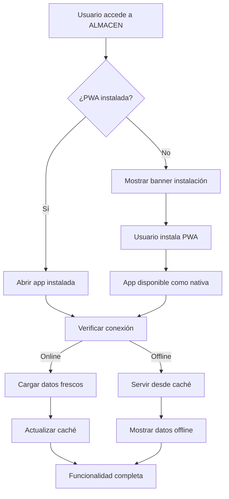

# Documento de Requerimientos PWA - Sistema ALMACEN

## 1. Descripción General del Proyecto

El Sistema ALMACEN es una aplicación web de gestión de almacén para obras de construcción que necesita ser convertida en una Progressive Web App (PWA) completa. La aplicación permite gestionar inventarios, materiales, solicitudes de compra, entradas y salidas de almacén, con funcionalidades específicas para coordinadores, logística y almaceneros.

El objetivo es transformar la aplicación web existente en una PWA que funcione offline, sea instalable en dispositivos móviles y de escritorio, y proporcione una experiencia nativa similar a las aplicaciones móviles tradicionales.

## 2. Características Principales de PWA

### 2.1 Roles de Usuario (Existentes)
| Rol | Método de Registro | Permisos Principales |
|-----|-------------------|---------------------|
| Coordinador | Registro por email con rol COORDINACION | Acceso completo al sistema, gestión de obras y usuarios |
| Logística | Registro por email con rol LOGISTICA | Gestión de solicitudes, órdenes de compra y reportes |
| Almacenero | Registro por email con rol ALMACENERO | Gestión de stock, entradas y salidas de materiales |

### 2.2 Módulos PWA a Implementar

Nuestra implementación PWA consistirá en los siguientes módulos principales:

1. **Manifest y Configuración PWA**: Configuración del manifest.json, iconos y metadatos de la aplicación
2. **Service Worker Mejorado**: Optimización del SW existente con estrategias de caché avanzadas
3. **Instalación de PWA**: Funcionalidad para instalar la app en dispositivos
4. **Modo Offline**: Capacidades offline completas para todas las funcionalidades críticas
5. **Notificaciones Push**: Sistema de notificaciones para alertas de stock y actualizaciones
6. **Actualización Automática**: Sistema de actualización automática de la aplicación

### 2.3 Detalles de Funcionalidades PWA

| Módulo | Componente | Descripción de Funcionalidad |
|--------|------------|------------------------------|
| Manifest PWA | Configuración Base | Definir nombre, descripción, iconos, colores de tema, modo de visualización y orientación |
| Manifest PWA | Iconos Adaptativos | Crear iconos en múltiples tamaños (192x192, 512x512) con versiones maskable |
| Service Worker | Estrategias de Caché | Implementar Cache First para assets estáticos, Network First para APIs críticas |
| Service Worker | Sincronización Background | Sincronizar datos cuando la conexión se restaure |
| Instalación PWA | Prompt de Instalación | Mostrar banner personalizado para instalar la app |
| Instalación PWA | Detección de Instalación | Detectar si la app ya está instalada y ocultar el prompt |
| Modo Offline | Caché de Datos | Cachear datos críticos: stock, materiales, obras, usuarios |
| Modo Offline | Página Offline | Mostrar página personalizada cuando no hay conexión |
| Modo Offline | Indicador de Estado | Mostrar estado de conexión en la interfaz |
| Notificaciones | Push Notifications | Enviar notificaciones para alertas de stock bajo y actualizaciones |
| Notificaciones | Permisos | Solicitar permisos de notificación de forma no intrusiva |
| Actualización | Update Prompt | Mostrar prompt cuando hay nueva versión disponible |
| Actualización | Auto-refresh | Actualizar automáticamente en segundo plano |

## 3. Flujos Principales PWA

### Flujo de Instalación PWA
El usuario accede a la aplicación web → El sistema detecta compatibilidad PWA → Se muestra banner de instalación → Usuario acepta instalación → La app se instala como aplicación nativa → Usuario puede acceder desde el escritorio/menú de aplicaciones.

### Flujo de Uso Offline
Usuario abre la aplicación sin conexión → Service Worker sirve contenido desde caché → Usuario puede consultar datos previamente cacheados → Las acciones se almacenan localmente → Cuando se restaura la conexión, los datos se sincronizan automáticamente.

### Flujo de Notificaciones
Sistema detecta evento crítico (stock bajo, nueva solicitud) → Se envía notificación push → Usuario recibe notificación en dispositivo → Al hacer clic, se abre la aplicación en la sección relevante.

## 4. Diseño de Interfaz PWA

### 4.1 Estilo de Diseño PWA
- **Colores primarios**: Azul corporativo (#3B82F6) y verde éxito (#10B981)
- **Colores secundarios**: Gris neutro (#6B7280) y blanco (#FFFFFF)
- **Estilo de botones**: Redondeados con sombras sutiles, estilo Material Design
- **Tipografía**: Inter o system fonts, tamaños 14px-24px
- **Layout**: Diseño responsivo con navegación bottom-tab en móvil, sidebar en desktop
- **Iconos**: Lucide React icons con estilo outline, tamaño 20-24px
- **Animaciones**: Transiciones suaves de 200-300ms

### 4.2 Elementos de Interfaz PWA

| Componente | Módulo | Elementos UI |
|------------|--------|--------------|
| Banner Instalación | Prompt PWA | Banner fijo en la parte superior con botón "Instalar App" y botón cerrar |
| Indicador Conexión | Estado Offline | Badge en header mostrando "Online/Offline" con colores verde/rojo |
| Página Offline | Modo Offline | Ilustración, mensaje "Sin conexión", lista de funciones disponibles offline |
| Notificación Update | Actualización | Toast notification con "Nueva versión disponible" y botón "Actualizar" |
| Splash Screen | Carga PWA | Logo centrado, spinner de carga, fondo con colores de marca |

### 4.3 Responsividad PWA
La PWA será mobile-first con adaptación completa a desktop. Se optimizará para touch en dispositivos móviles con botones de mínimo 44px de altura. La navegación se adaptará automáticamente: bottom navigation en móvil y sidebar en desktop.

## 5. Consideraciones Técnicas

### 5.1 Compatibilidad
- Soporte para Chrome, Firefox, Safari y Edge
- Funcionalidad completa en dispositivos iOS y Android
- Degradación elegante en navegadores sin soporte PWA

### 5.2 Performance
- Tiempo de carga inicial < 3 segundos
- Tiempo de respuesta offline < 1 segundo
- Tamaño de caché optimizado < 50MB

### 5.3 Seguridad
- HTTPS obligatorio para todas las funcionalidades PWA
- Validación de integridad de Service Worker
- Encriptación de datos sensibles en caché local