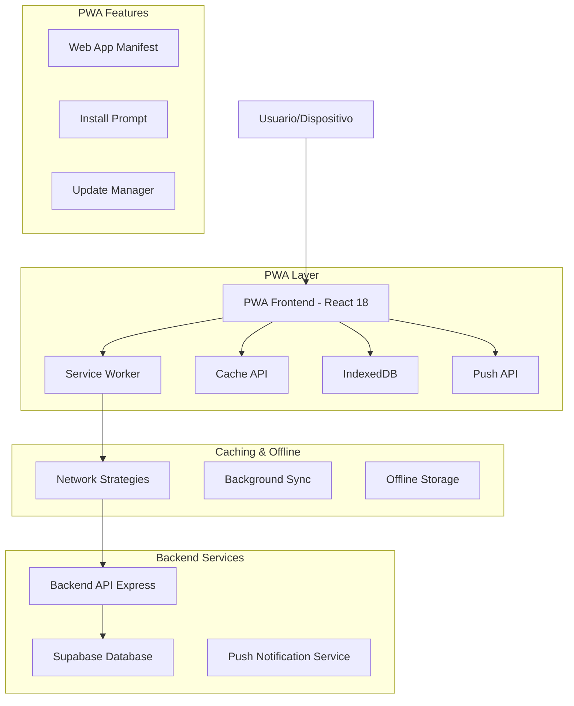
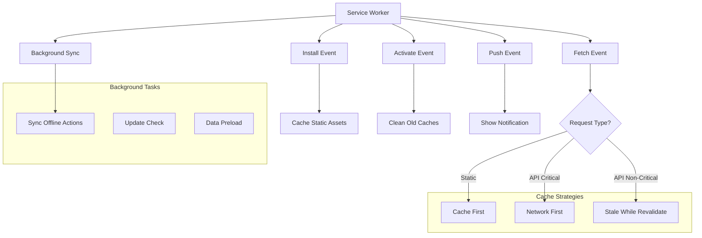
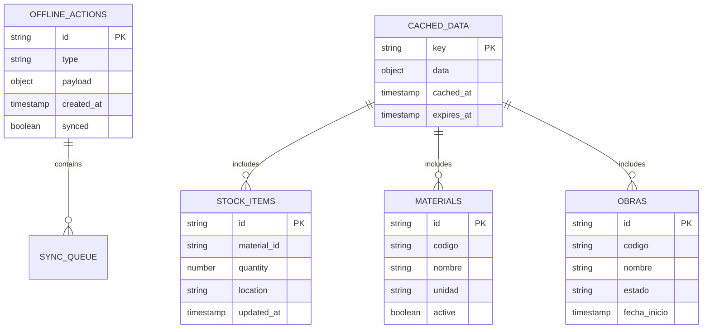

# Arquitectura Técnica PWA - Sistema ALMACEN

## 1. Arquitectura de Diseño



## 2. Descripción de Tecnologías

### Frontend PWA
- **React@18** + **TypeScript** + **Vite** - Framework principal con build optimizado para PWA
- **Tailwind CSS@3** - Estilos responsivos y mobile-first
- **Workbox** - Librería para Service Worker y estrategias de caché
- **idb** - Wrapper para IndexedDB para almacenamiento offline
- **React Query/TanStack Query** - Gestión de estado y caché de datos

### Backend y Servicios
- **Express@4** - API backend existente
- **Supabase** - Base de datos PostgreSQL y autenticación
- **Web Push** - Servicio de notificaciones push
- **Socket.io** - WebSockets para actualizaciones en tiempo real

### PWA Core
- **Service Worker** - Caché, offline, background sync
- **Web App Manifest** - Configuración de instalación
- **Cache API** - Almacenamiento de recursos estáticos
- **IndexedDB** - Base de datos local para datos offline

## 3. Definiciones de Rutas PWA

| Ruta | Propósito | Caché Strategy |
|------|-----------|----------------|
| / | Página principal con dashboard | Stale While Revalidate |
| /login | Autenticación de usuarios | Network First |
| /dashboard | Panel principal de control | Stale While Revalidate |
| /stock | Gestión de inventario | Network First con fallback |
| /materiales | Catálogo de materiales | Cache First |
| /entradas | Registro de entradas | Network First |
| /salidas | Registro de salidas | Network First |
| /requerimientos | Solicitudes de materiales | Network First |
| /obras | Gestión de obras | Cache First |
| /reportes | Reportes y analytics | Network Only |
| /perfil | Perfil de usuario | Stale While Revalidate |
| /offline | Página offline personalizada | Cache First |

## 4. Definiciones de API PWA

### 4.1 APIs Core del Sistema

**Autenticación y Sesión**
```
POST /api/auth/login
```
Request:
| Parámetro | Tipo | Requerido | Descripción |
|-----------|------|-----------|-------------|
| email | string | true | Email del usuario |
| password | string | true | Contraseña |

Response:
| Parámetro | Tipo | Descripción |
|-----------|------|-------------|
| success | boolean | Estado de la autenticación |
| token | string | JWT token |
| user | object | Datos del usuario |

**Sincronización Offline**
```
POST /api/sync/offline-data
```
Request:
| Parámetro | Tipo | Requerido | Descripción |
|-----------|------|-----------|-------------|
| actions | array | true | Array de acciones offline |
| timestamp | string | true | Timestamp de sincronización |

**Notificaciones Push**
```
POST /api/notifications/subscribe
```
Request:
| Parámetro | Tipo | Requerido | Descripción |
|-----------|------|-----------|-------------|
| subscription | object | true | Objeto de suscripción push |
| userId | string | true | ID del usuario |

### 4.2 APIs de Datos Críticos

**Stock y Materiales (Offline-First)**
```
GET /api/stock/critical-data
```
Response: Datos esenciales para funcionamiento offline

**Obras Activas**
```
GET /api/obras/active
```
Response: Lista de obras activas para caché

## 5. Arquitectura del Service Worker



## 6. Modelo de Datos Offline

### 6.1 Definición del Modelo de Datos



### 6.2 Esquema de Base de Datos Local (IndexedDB)

**Store: offline_actions**
```javascript
// Estructura para acciones offline
{
  id: string,
  type: 'CREATE_ENTRADA' | 'CREATE_SALIDA' | 'UPDATE_STOCK',
  payload: object,
  timestamp: number,
  synced: boolean,
  retryCount: number
}
```

**Store: cached_data**
```javascript
// Estructura para datos cacheados
{
  key: string, // 'stock_items', 'materials', 'obras'
  data: object,
  cachedAt: number,
  expiresAt: number,
  version: string
}
```

**Store: user_preferences**
```javascript
// Configuraciones PWA del usuario
{
  userId: string,
  notifications: boolean,
  offlineMode: boolean,
  autoSync: boolean,
  theme: 'light' | 'dark',
  language: string
}
```

## 7. Configuración de Build PWA

### 7.1 Vite Configuration para PWA
```javascript
// vite.config.ts - Configuración PWA
import { defineConfig } from 'vite'
import react from '@vitejs/plugin-react'
import { VitePWA } from 'vite-plugin-pwa'

export default defineConfig({
  plugins: [
    react(),
    VitePWA({
      registerType: 'autoUpdate',
      workbox: {
        globPatterns: ['**/*.{js,css,html,ico,png,svg}'],
        runtimeCaching: [
          {
            urlPattern: /^https:\/\/api\./,
            handler: 'NetworkFirst',
            options: {
              cacheName: 'api-cache',
              expiration: {
                maxEntries: 100,
                maxAgeSeconds: 60 * 60 * 24 // 24 horas
              }
            }
          }
        ]
      },
      manifest: {
        name: 'Sistema ALMACEN',
        short_name: 'ALMACEN',
        description: 'Sistema de gestión de almacén para obras',
        theme_color: '#3B82F6',
        background_color: '#FFFFFF',
        display: 'standalone',
        orientation: 'portrait-primary',
        scope: '/',
        start_url: '/',
        icons: [
          {
            src: 'icons/icon-192x192.png',
            sizes: '192x192',
            type: 'image/png'
          },
          {
            src: 'icons/icon-512x512.png',
            sizes: '512x512',
            type: 'image/png'
          }
        ]
      }
    })
  ]
})
```

### 7.2 Dependencias PWA Adicionales
```json
{
  "dependencies": {
    "workbox-window": "^7.0.0",
    "idb": "^8.0.0",
    "@tanstack/react-query": "^5.0.0",
    "web-push": "^3.6.0"
  },
  "devDependencies": {
    "vite-plugin-pwa": "^0.17.0",
    "@types/web-push": "^3.6.0"
  }
}
```

## 8. Estrategias de Implementación

### 8.1 Fases de Implementación
1. **Fase 1**: Configuración básica PWA (Manifest + Service Worker mejorado)
2. **Fase 2**: Funcionalidad offline completa (IndexedDB + Sync)
3. **Fase 3**: Notificaciones push y actualización automática
4. **Fase 4**: Optimizaciones de performance y UX

### 8.2 Consideraciones de Performance
- Lazy loading de componentes no críticos
- Code splitting por rutas
- Preload de datos críticos en background
- Compresión de assets estáticos
- Optimización de imágenes con WebP

### 8.3 Testing PWA
- Lighthouse PWA audit score > 90
- Testing offline en diferentes dispositivos
- Pruebas de instalación en iOS/Android
- Validación de notificaciones push
- Testing de sincronización background