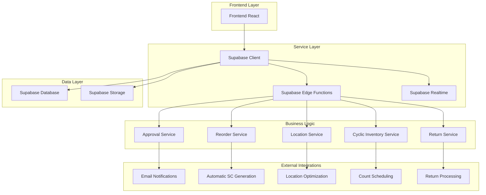
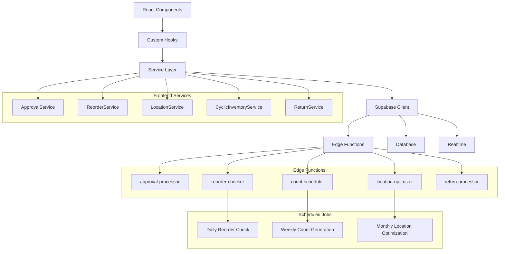
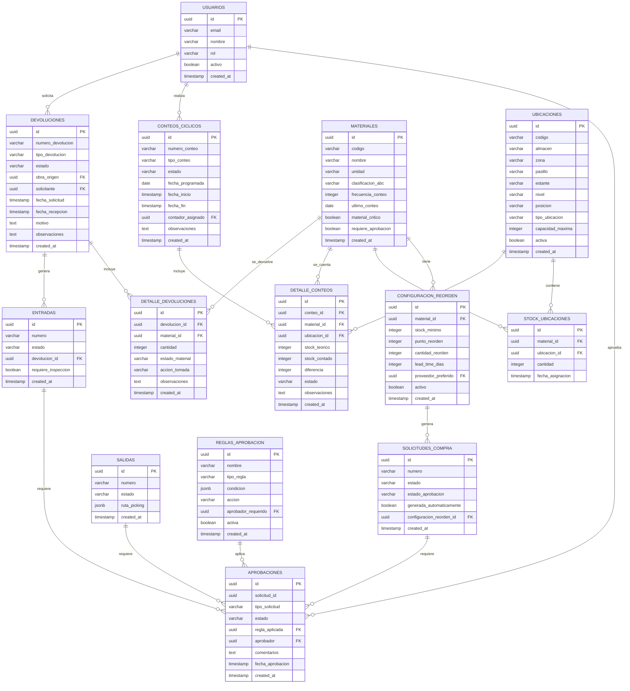

# Arquitectura Técnica - Funcionalidades Avanzadas

## 1. Arquitectura General del Sistema



## 2. Descripción de Tecnologías

- **Frontend**: React@18 + TypeScript + Tailwind CSS + Vite
- **Backend**: Supabase (PostgreSQL + Edge Functions + Realtime + Storage)
- **Autenticación**: Supabase Auth
- **Base de Datos**: PostgreSQL (Supabase)
- **Notificaciones**: Supabase Realtime + Web Push API
- **Almacenamiento**: Supabase Storage (para fotos de devoluciones)
- **Programación de Tareas**: Supabase Edge Functions + Cron Jobs

### 2.1 Librerías Adicionales
- `@supabase/supabase-js`: Cliente de Supabase
- `react-query`: Gestión de estado del servidor
- `react-hook-form`: Manejo de formularios
- `date-fns`: Manipulación de fechas
- `recharts`: Gráficos y visualizaciones
- `react-hot-toast`: Notificaciones toast
- `lucide-react`: Iconos
- `html2canvas`: Captura de pantalla para reportes
- `jspdf`: Generación de PDFs

## 3. Definiciones de Rutas

| Ruta | Propósito |
|------|----------|
| `/approvals` | Panel de aprobaciones pendientes |
| `/approvals/config` | Configuración de reglas de aprobación |
| `/reorder` | Dashboard de reorden automático |
| `/reorder/config` | Configuración de parámetros de reorden |
| `/locations` | Mapa y gestión de ubicaciones |
| `/locations/assign` | Asignación manual de ubicaciones |
| `/inventory/cyclic` | Gestión de inventarios cíclicos |
| `/inventory/count/:id` | Interface de conteo específico |
| `/returns` | Gestión de devoluciones |
| `/returns/create` | Crear nueva devolución |
| `/returns/inspect/:id` | Inspección de devolución |

## 4. Definiciones de API (Edge Functions)

### 4.1 Approval Service APIs

#### Evaluar Reglas de Aprobación
```
POST /functions/v1/evaluate-approval
```

**Request:**
| Parámetro | Tipo | Requerido | Descripción |
|-----------|------|-----------|-------------|
| solicitud_id | UUID | true | ID de la solicitud |
| tipo_solicitud | string | true | Tipo: 'sc', 'entrada', 'salida' |
| monto_total | number | false | Monto total de la solicitud |
| materiales | array | false | Lista de materiales involucrados |

**Response:**
| Campo | Tipo | Descripción |
|-------|------|-------------|
| requiere_aprobacion | boolean | Si requiere aprobación manual |
| aprobacion_automatica | boolean | Si puede ser aprobada automáticamente |
| aprobador_requerido | UUID | ID del aprobador necesario |
| regla_aplicada | UUID | ID de la regla aplicada |
| motivo | string | Razón de la decisión |

**Ejemplo:**
```json
{
  "solicitud_id": "123e4567-e89b-12d3-a456-426614174000",
  "tipo_solicitud": "sc",
  "monto_total": 1500.00,
  "materiales": [
    {
      "id": "mat-001",
      "es_critico": false,
      "requiere_aprobacion": false
    }
  ]
}
```

#### Procesar Aprobación
```
POST /functions/v1/process-approval
```

**Request:**
| Parámetro | Tipo | Requerido | Descripción |
|-----------|------|-----------|-------------|
| aprobacion_id | UUID | true | ID de la aprobación |
| accion | string | true | 'aprobar', 'rechazar', 'escalar' |
| comentarios | string | false | Comentarios del aprobador |
| aprobador_id | UUID | true | ID del usuario que aprueba |

### 4.2 Reorder Service APIs

#### Verificar Puntos de Reorden
```
POST /functions/v1/check-reorder-points
```

**Request:**
| Parámetro | Tipo | Requerido | Descripción |
|-----------|------|-----------|-------------|
| material_ids | array | false | IDs específicos a verificar (opcional) |
| force_check | boolean | false | Forzar verificación completa |

**Response:**
| Campo | Tipo | Descripción |
|-------|------|-------------|
| materiales_reorden | array | Lista de materiales que requieren reorden |
| solicitudes_generadas | array | SCs generadas automáticamente |
| errores | array | Errores durante el proceso |

#### Generar Solicitud de Compra Automática
```
POST /functions/v1/generate-auto-purchase-request
```

**Request:**
| Parámetro | Tipo | Requerido | Descripción |
|-----------|------|-----------|-------------|
| material_id | UUID | true | ID del material |
| cantidad_sugerida | number | false | Cantidad sugerida (calculada si no se proporciona) |
| proveedor_id | UUID | false | Proveedor preferido |

### 4.3 Location Service APIs

#### Asignar Ubicación Automática
```
POST /functions/v1/assign-location
```

**Request:**
| Parámetro | Tipo | Requerido | Descripción |
|-----------|------|-----------|-------------|
| material_id | UUID | true | ID del material |
| cantidad | number | true | Cantidad a ubicar |
| tipo_ubicacion | string | false | Tipo preferido de ubicación |
| zona_preferida | string | false | Zona preferida |

**Response:**
| Campo | Tipo | Descripción |
|-------|------|-------------|
| ubicacion_asignada | object | Detalles de la ubicación asignada |
| codigo_ubicacion | string | Código de la ubicación |
| capacidad_restante | number | Capacidad restante en la ubicación |

#### Generar Ruta de Picking
```
POST /functions/v1/generate-picking-route
```

**Request:**
| Parámetro | Tipo | Requerido | Descripción |
|-----------|------|-----------|-------------|
| materiales | array | true | Lista de materiales a recoger |
| almacen | string | false | Almacén específico |
| optimizar | boolean | true | Si optimizar la ruta |

### 4.4 Cyclic Inventory APIs

#### Generar Conteos Programados
```
POST /functions/v1/generate-cyclic-counts
```

**Request:**
| Parámetro | Tipo | Requerido | Descripción |
|-----------|------|-----------|-------------|
| fecha_inicio | date | true | Fecha de inicio del período |
| fecha_fin | date | true | Fecha de fin del período |
| tipo_conteo | string | false | Tipo específico de conteo |

#### Procesar Resultados de Conteo
```
POST /functions/v1/process-count-results
```

**Request:**
| Parámetro | Tipo | Requerido | Descripción |
|-----------|------|-----------|-------------|
| conteo_id | UUID | true | ID del conteo |
| resultados | array | true | Resultados del conteo |
| contador_id | UUID | true | ID del contador |

### 4.5 Return Service APIs

#### Crear Devolución
```
POST /functions/v1/create-return
```

**Request:**
| Parámetro | Tipo | Requerido | Descripción |
|-----------|------|-----------|-------------|
| tipo_devolucion | string | true | Tipo de devolución |
| obra_origen | UUID | false | Obra de origen |
| materiales | array | true | Lista de materiales a devolver |
| motivo | string | true | Motivo de la devolución |

#### Procesar Inspección de Devolución
```
POST /functions/v1/process-return-inspection
```

**Request:**
| Parámetro | Tipo | Requerido | Descripción |
|-----------|------|-----------|-------------|
| devolucion_id | UUID | true | ID de la devolución |
| resultados_inspeccion | array | true | Resultados de la inspección |
| inspector_id | UUID | true | ID del inspector |

## 5. Arquitectura de Servicios



## 6. Modelo de Datos Extendido

### 6.1 Diagrama de Entidad-Relación



### 6.2 Definiciones DDL Completas

#### Tabla: reglas_aprobacion
```sql
CREATE TABLE reglas_aprobacion (
    id UUID PRIMARY KEY DEFAULT gen_random_uuid(),
    nombre VARCHAR(100) NOT NULL,
    tipo_regla VARCHAR(20) NOT NULL CHECK (tipo_regla IN ('monto', 'material', 'usuario', 'obra', 'combinado')),
    condicion JSONB NOT NULL,
    accion VARCHAR(20) NOT NULL CHECK (accion IN ('aprobar', 'rechazar', 'escalar')),
    aprobador_requerido UUID REFERENCES usuarios(id),
    prioridad INTEGER DEFAULT 1,
    activa BOOLEAN DEFAULT true,
    created_at TIMESTAMP WITH TIME ZONE DEFAULT NOW(),
    updated_at TIMESTAMP WITH TIME ZONE DEFAULT NOW()
);

-- Índices
CREATE INDEX idx_reglas_aprobacion_tipo ON reglas_aprobacion(tipo_regla);
CREATE INDEX idx_reglas_aprobacion_activa ON reglas_aprobacion(activa);
CREATE INDEX idx_reglas_aprobacion_prioridad ON reglas_aprobacion(prioridad DESC);

-- RLS
ALTER TABLE reglas_aprobacion ENABLE ROW LEVEL SECURITY;
CREATE POLICY "Usuarios autenticados pueden ver reglas" ON reglas_aprobacion FOR SELECT TO authenticated USING (true);
CREATE POLICY "Solo administradores pueden modificar reglas" ON reglas_aprobacion FOR ALL TO authenticated USING (auth.jwt() ->> 'rol' = 'administrador');
```

#### Tabla: aprobaciones
```sql
CREATE TABLE aprobaciones (
    id UUID PRIMARY KEY DEFAULT gen_random_uuid(),
    solicitud_id UUID NOT NULL,
    tipo_solicitud VARCHAR(20) NOT NULL CHECK (tipo_solicitud IN ('sc', 'entrada', 'salida')),
    estado VARCHAR(20) DEFAULT 'pendiente' CHECK (estado IN ('pendiente', 'aprobado', 'rechazado', 'escalado')),
    regla_aplicada UUID REFERENCES reglas_aprobacion(id),
    aprobador UUID REFERENCES usuarios(id),
    comentarios TEXT,
    fecha_aprobacion TIMESTAMP WITH TIME ZONE,
    monto_evaluado DECIMAL(12,2),
    created_at TIMESTAMP WITH TIME ZONE DEFAULT NOW(),
    updated_at TIMESTAMP WITH TIME ZONE DEFAULT NOW()
);

-- Índices
CREATE INDEX idx_aprobaciones_solicitud ON aprobaciones(solicitud_id, tipo_solicitud);
CREATE INDEX idx_aprobaciones_estado ON aprobaciones(estado);
CREATE INDEX idx_aprobaciones_aprobador ON aprobaciones(aprobador);
CREATE INDEX idx_aprobaciones_fecha ON aprobaciones(fecha_aprobacion DESC);

-- RLS
ALTER TABLE aprobaciones ENABLE ROW LEVEL SECURITY;
CREATE POLICY "Usuarios pueden ver sus aprobaciones" ON aprobaciones FOR SELECT TO authenticated USING (
    aprobador = auth.uid() OR 
    auth.jwt() ->> 'rol' IN ('administrador', 'supervisor')
);
```

#### Tabla: configuracion_reorden
```sql
CREATE TABLE configuracion_reorden (
    id UUID PRIMARY KEY DEFAULT gen_random_uuid(),
    material_id UUID REFERENCES materiales(id) ON DELETE CASCADE,
    stock_minimo INTEGER NOT NULL CHECK (stock_minimo >= 0),
    punto_reorden INTEGER NOT NULL CHECK (punto_reorden >= stock_minimo),
    cantidad_reorden INTEGER NOT NULL CHECK (cantidad_reorden > 0),
    lead_time_dias INTEGER DEFAULT 7 CHECK (lead_time_dias > 0),
    proveedor_preferido UUID,
    consumo_promedio_mensual DECIMAL(10,2),
    estacionalidad JSONB,
    activo BOOLEAN DEFAULT true,
    created_at TIMESTAMP WITH TIME ZONE DEFAULT NOW(),
    updated_at TIMESTAMP WITH TIME ZONE DEFAULT NOW(),
    UNIQUE(material_id)
);

-- Índices
CREATE INDEX idx_config_reorden_material ON configuracion_reorden(material_id);
CREATE INDEX idx_config_reorden_activo ON configuracion_reorden(activo);
CREATE INDEX idx_config_reorden_punto ON configuracion_reorden(punto_reorden);

-- RLS
ALTER TABLE configuracion_reorden ENABLE ROW LEVEL SECURITY;
CREATE POLICY "Usuarios autenticados pueden ver configuración" ON configuracion_reorden FOR SELECT TO authenticated USING (true);
CREATE POLICY "Solo supervisores pueden modificar configuración" ON configuracion_reorden FOR ALL TO authenticated USING (
    auth.jwt() ->> 'rol' IN ('administrador', 'supervisor')
);
```

#### Tabla: ubicaciones
```sql
CREATE TABLE ubicaciones (
    id UUID PRIMARY KEY DEFAULT gen_random_uuid(),
    codigo VARCHAR(50) UNIQUE NOT NULL,
    almacen VARCHAR(10) NOT NULL,
    zona VARCHAR(10) NOT NULL,
    pasillo VARCHAR(10) NOT NULL,
    estante VARCHAR(10) NOT NULL,
    nivel VARCHAR(10) NOT NULL,
    posicion VARCHAR(10) NOT NULL,
    tipo_ubicacion VARCHAR(20) DEFAULT 'flotante' CHECK (tipo_ubicacion IN ('fija', 'flotante', 'picking', 'reserva', 'cuarentena')),
    capacidad_maxima INTEGER,
    dimensiones JSONB, -- {"largo": 100, "ancho": 50, "alto": 200}
    restricciones JSONB, -- {"peso_max": 1000, "tipos_permitidos": ["A", "B"]}
    activa BOOLEAN DEFAULT true,
    created_at TIMESTAMP WITH TIME ZONE DEFAULT NOW(),
    updated_at TIMESTAMP WITH TIME ZONE DEFAULT NOW()
);

-- Índices
CREATE INDEX idx_ubicaciones_codigo ON ubicaciones(codigo);
CREATE INDEX idx_ubicaciones_almacen_zona ON ubicaciones(almacen, zona);
CREATE INDEX idx_ubicaciones_tipo ON ubicaciones(tipo_ubicacion);
CREATE INDEX idx_ubicaciones_activa ON ubicaciones(activa);

-- RLS
ALTER TABLE ubicaciones ENABLE ROW LEVEL SECURITY;
CREATE POLICY "Usuarios autenticados pueden ver ubicaciones" ON ubicaciones FOR SELECT TO authenticated USING (true);
CREATE POLICY "Solo almacenistas pueden modificar ubicaciones" ON ubicaciones FOR ALL TO authenticated USING (
    auth.jwt() ->> 'rol' IN ('administrador', 'almacenista')
);
```

#### Tabla: stock_ubicaciones
```sql
CREATE TABLE stock_ubicaciones (
    id UUID PRIMARY KEY DEFAULT gen_random_uuid(),
    material_id UUID REFERENCES materiales(id) ON DELETE CASCADE,
    ubicacion_id UUID REFERENCES ubicaciones(id) ON DELETE CASCADE,
    cantidad INTEGER NOT NULL DEFAULT 0 CHECK (cantidad >= 0),
    fecha_asignacion TIMESTAMP WITH TIME ZONE DEFAULT NOW(),
    fecha_ultimo_movimiento TIMESTAMP WITH TIME ZONE DEFAULT NOW(),
    created_at TIMESTAMP WITH TIME ZONE DEFAULT NOW(),
    updated_at TIMESTAMP WITH TIME ZONE DEFAULT NOW(),
    UNIQUE(material_id, ubicacion_id)
);

-- Índices
CREATE INDEX idx_stock_ubicaciones_material ON stock_ubicaciones(material_id);
CREATE INDEX idx_stock_ubicaciones_ubicacion ON stock_ubicaciones(ubicacion_id);
CREATE INDEX idx_stock_ubicaciones_cantidad ON stock_ubicaciones(cantidad DESC);

-- RLS
ALTER TABLE stock_ubicaciones ENABLE ROW LEVEL SECURITY;
CREATE POLICY "Usuarios autenticados pueden ver stock por ubicación" ON stock_ubicaciones FOR SELECT TO authenticated USING (true);
CREATE POLICY "Solo almacenistas pueden modificar stock por ubicación" ON stock_ubicaciones FOR ALL TO authenticated USING (
    auth.jwt() ->> 'rol' IN ('administrador', 'almacenista')
);
```

#### Tabla: conteos_ciclicos
```sql
CREATE TABLE conteos_ciclicos (
    id UUID PRIMARY KEY DEFAULT gen_random_uuid(),
    numero_conteo VARCHAR(20) UNIQUE NOT NULL,
    tipo_conteo VARCHAR(20) NOT NULL CHECK (tipo_conteo IN ('abc', 'rotacion', 'aleatorio', 'ubicacion', 'excepcion')),
    estado VARCHAR(20) DEFAULT 'programado' CHECK (estado IN ('programado', 'asignado', 'en_proceso', 'completado', 'cancelado')),
    fecha_programada DATE NOT NULL,
    fecha_inicio TIMESTAMP WITH TIME ZONE,
    fecha_fin TIMESTAMP WITH TIME ZONE,
    contador_asignado UUID REFERENCES usuarios(id),
    criterios_seleccion JSONB,
    observaciones TEXT,
    precision_obtenida DECIMAL(5,2),
    created_at TIMESTAMP WITH TIME ZONE DEFAULT NOW(),
    updated_at TIMESTAMP WITH TIME ZONE DEFAULT NOW()
);

-- Índices
CREATE INDEX idx_conteos_numero ON conteos_ciclicos(numero_conteo);
CREATE INDEX idx_conteos_estado ON conteos_ciclicos(estado);
CREATE INDEX idx_conteos_fecha_programada ON conteos_ciclicos(fecha_programada);
CREATE INDEX idx_conteos_contador ON conteos_ciclicos(contador_asignado);

-- RLS
ALTER TABLE conteos_ciclicos ENABLE ROW LEVEL SECURITY;
CREATE POLICY "Usuarios pueden ver conteos asignados" ON conteos_ciclicos FOR SELECT TO authenticated USING (
    contador_asignado = auth.uid() OR 
    auth.jwt() ->> 'rol' IN ('administrador', 'supervisor')
);
```

#### Tabla: detalle_conteos
```sql
CREATE TABLE detalle_conteos (
    id UUID PRIMARY KEY DEFAULT gen_random_uuid(),
    conteo_id UUID REFERENCES conteos_ciclicos(id) ON DELETE CASCADE,
    material_id UUID REFERENCES materiales(id),
    ubicacion_id UUID REFERENCES ubicaciones(id),
    stock_teorico INTEGER NOT NULL,
    stock_contado INTEGER,
    diferencia INTEGER GENERATED ALWAYS AS (stock_contado - stock_teorico) STORED,
    porcentaje_diferencia DECIMAL(5,2) GENERATED ALWAYS AS (
        CASE WHEN stock_teorico = 0 THEN 0 
        ELSE (stock_contado - stock_teorico) * 100.0 / stock_teorico 
        END
    ) STORED,
    estado VARCHAR(20) DEFAULT 'pendiente' CHECK (estado IN ('pendiente', 'contado', 'ajustado', 'rechazado')),
    observaciones TEXT,
    foto_evidencia TEXT,
    created_at TIMESTAMP WITH TIME ZONE DEFAULT NOW(),
    updated_at TIMESTAMP WITH TIME ZONE DEFAULT NOW()
);

-- Índices
CREATE INDEX idx_detalle_conteos_conteo ON detalle_conteos(conteo_id);
CREATE INDEX idx_detalle_conteos_material ON detalle_conteos(material_id);
CREATE INDEX idx_detalle_conteos_diferencia ON detalle_conteos(diferencia);
CREATE INDEX idx_detalle_conteos_estado ON detalle_conteos(estado);

-- RLS
ALTER TABLE detalle_conteos ENABLE ROW LEVEL SECURITY;
CREATE POLICY "Usuarios pueden ver detalles de sus conteos" ON detalle_conteos FOR SELECT TO authenticated USING (
    EXISTS (
        SELECT 1 FROM conteos_ciclicos cc 
        WHERE cc.id = conteo_id AND 
        (cc.contador_asignado = auth.uid() OR auth.jwt() ->> 'rol' IN ('administrador', 'supervisor'))
    )
);
```

#### Tabla: devoluciones
```sql
CREATE TABLE devoluciones (
    id UUID PRIMARY KEY DEFAULT gen_random_uuid(),
    numero_devolucion VARCHAR(20) UNIQUE NOT NULL,
    tipo_devolucion VARCHAR(30) NOT NULL CHECK (tipo_devolucion IN ('obra', 'defectuoso', 'proveedor', 'reparacion', 'exceso')),
    estado VARCHAR(20) DEFAULT 'solicitada' CHECK (estado IN ('solicitada', 'en_transito', 'recibida', 'en_inspeccion', 'aprobada', 'rechazada', 'procesada')),
    obra_origen UUID REFERENCES obras(id),
    solicitante UUID REFERENCES usuarios(id),
    fecha_solicitud TIMESTAMP WITH TIME ZONE DEFAULT NOW(),
    fecha_recepcion TIMESTAMP WITH TIME ZONE,
    fecha_inspeccion TIMESTAMP WITH TIME ZONE,
    inspector UUID REFERENCES usuarios(id),
    motivo TEXT NOT NULL,
    observaciones TEXT,
    valor_estimado DECIMAL(12,2),
    created_at TIMESTAMP WITH TIME ZONE DEFAULT NOW(),
    updated_at TIMESTAMP WITH TIME ZONE DEFAULT NOW()
);

-- Índices
CREATE INDEX idx_devoluciones_numero ON devoluciones(numero_devolucion);
CREATE INDEX idx_devoluciones_estado ON devoluciones(estado);
CREATE INDEX idx_devoluciones_tipo ON devoluciones(tipo_devolucion);
CREATE INDEX idx_devoluciones_solicitante ON devoluciones(solicitante);
CREATE INDEX idx_devoluciones_fecha ON devoluciones(fecha_solicitud DESC);

-- RLS
ALTER TABLE devoluciones ENABLE ROW LEVEL SECURITY;
CREATE POLICY "Usuarios pueden ver sus devoluciones" ON devoluciones FOR SELECT TO authenticated USING (
    solicitante = auth.uid() OR 
    inspector = auth.uid() OR
    auth.jwt() ->> 'rol' IN ('administrador', 'supervisor')
);
```

#### Tabla: detalle_devoluciones
```sql
CREATE TABLE detalle_devoluciones (
    id UUID PRIMARY KEY DEFAULT gen_random_uuid(),
    devolucion_id UUID REFERENCES devoluciones(id) ON DELETE CASCADE,
    material_id UUID REFERENCES materiales(id),
    cantidad INTEGER NOT NULL CHECK (cantidad > 0),
    estado_material VARCHAR(20) NOT NULL CHECK (estado_material IN ('bueno', 'defectuoso', 'reparable', 'obsoleto')),
    accion_tomada VARCHAR(30) CHECK (accion_tomada IN ('reintegrar', 'reparar', 'descartar', 'devolver_proveedor', 'vender_usado')),
    ubicacion_destino UUID REFERENCES ubicaciones(id),
    valor_unitario DECIMAL(10,2),
    observaciones TEXT,
    fotos JSONB, -- Array de URLs de fotos
    created_at TIMESTAMP WITH TIME ZONE DEFAULT NOW(),
    updated_at TIMESTAMP WITH TIME ZONE DEFAULT NOW()
);

-- Índices
CREATE INDEX idx_detalle_devoluciones_devolucion ON detalle_devoluciones(devolucion_id);
CREATE INDEX idx_detalle_devoluciones_material ON detalle_devoluciones(material_id);
CREATE INDEX idx_detalle_devoluciones_estado ON detalle_devoluciones(estado_material);
CREATE INDEX idx_detalle_devoluciones_accion ON detalle_devoluciones(accion_tomada);

-- RLS
ALTER TABLE detalle_devoluciones ENABLE ROW LEVEL SECURITY;
CREATE POLICY "Usuarios pueden ver detalles de devoluciones autorizadas" ON detalle_devoluciones FOR SELECT TO authenticated USING (
    EXISTS (
        SELECT 1 FROM devoluciones d 
        WHERE d.id = devolucion_id AND 
        (d.solicitante = auth.uid() OR d.inspector = auth.uid() OR auth.jwt() ->> 'rol' IN ('administrador', 'supervisor'))
    )
);
```

### 6.3 Funciones y Triggers

#### Función: Actualizar Stock en Ubicaciones
```sql
CREATE OR REPLACE FUNCTION actualizar_stock_ubicacion()
RETURNS TRIGGER AS $$
BEGIN
    -- Actualizar fecha de último movimiento
    UPDATE stock_ubicaciones 
    SET fecha_ultimo_movimiento = NOW(),
        updated_at = NOW()
    WHERE material_id = NEW.material_id;
    
    RETURN NEW;
END;
$$ LANGUAGE plpgsql;

CREATE TRIGGER trigger_actualizar_stock_ubicacion
    AFTER INSERT OR UPDATE ON stock_ubicaciones
    FOR EACH ROW
    EXECUTE FUNCTION actualizar_stock_ubicacion();
```

#### Función: Verificar Puntos de Reorden
```sql
CREATE OR REPLACE FUNCTION verificar_puntos_reorden()
RETURNS TABLE(
    material_id UUID,
    codigo_material VARCHAR,
    stock_actual INTEGER,
    punto_reorden INTEGER,
    cantidad_sugerida INTEGER
) AS $$
BEGIN
    RETURN QUERY
    SELECT 
        m.id,
        m.codigo,
        COALESCE(s.stock_actual, 0),
        cr.punto_reorden,
        cr.cantidad_reorden
    FROM materiales m
    JOIN configuracion_reorden cr ON m.id = cr.material_id
    LEFT JOIN stock s ON m.id = s.material_id
    WHERE cr.activo = true
    AND COALESCE(s.stock_actual, 0) <= cr.punto_reorden;
END;
$$ LANGUAGE plpgsql;
```

#### Función: Generar Código de Ubicación
```sql
CREATE OR REPLACE FUNCTION generar_codigo_ubicacion(
    p_almacen VARCHAR,
    p_zona VARCHAR,
    p_pasillo VARCHAR,
    p_estante VARCHAR,
    p_nivel VARCHAR,
    p_posicion VARCHAR
) RETURNS VARCHAR AS $$
BEGIN
    RETURN CONCAT(p_almacen, '-', p_zona, '-', p_pasillo, '-', p_estante, '-', p_nivel, '-', p_posicion);
END;
$$ LANGUAGE plpgsql;
```

### 6.4 Vistas Útiles

#### Vista: Stock con Ubicaciones
```sql
CREATE VIEW vista_stock_ubicaciones AS
SELECT 
    m.id as material_id,
    m.codigo,
    m.nombre,
    u.codigo as ubicacion,
    u.almacen,
    u.zona,
    su.cantidad,
    u.tipo_ubicacion,
    su.fecha_ultimo_movimiento
FROM materiales m
JOIN stock_ubicaciones su ON m.id = su.material_id
JOIN ubicaciones u ON su.ubicacion_id = u.id
WHERE su.cantidad > 0 AND u.activa = true;
```

#### Vista: Materiales Pendientes de Reorden
```sql
CREATE VIEW vista_materiales_reorden AS
SELECT 
    m.id,
    m.codigo,
    m.nombre,
    s.stock_actual,
    cr.punto_reorden,
    cr.cantidad_reorden,
    cr.lead_time_dias,
    (cr.punto_reorden - COALESCE(s.stock_actual, 0)) as deficit
FROM materiales m
JOIN configuracion_reorden cr ON m.id = cr.material_id
LEFT JOIN stock s ON m.id = s.material_id
WHERE cr.activo = true
AND COALESCE(s.stock_actual, 0) <= cr.punto_reorden;
```

#### Vista: Resumen de Conteos Cíclicos
```sql
CREATE VIEW vista_resumen_conteos AS
SELECT 
    cc.id,
    cc.numero_conteo,
    cc.tipo_conteo,
    cc.estado,
    cc.fecha_programada,
    u.nombre as contador,
    COUNT(dc.id) as total_items,
    COUNT(CASE WHEN dc.estado = 'contado' THEN 1 END) as items_contados,
    COUNT(CASE WHEN ABS(dc.diferencia) > 0 THEN 1 END) as items_con_diferencia,
    AVG(ABS(dc.porcentaje_diferencia)) as precision_promedio
FROM conteos_ciclicos cc
LEFT JOIN usuarios u ON cc.contador_asignado = u.id
LEFT JOIN detalle_conteos dc ON cc.id = dc.conteo_id
GROUP BY cc.id, cc.numero_conteo, cc.tipo_conteo, cc.estado, cc.fecha_programada, u.nombre;
```

## 7. Consideraciones de Rendimiento

### 7.1 Optimizaciones de Base de Datos
- Índices compuestos para consultas frecuentes
- Particionamiento de tablas históricas por fecha
- Materialización de vistas para reportes complejos
- Compresión de datos JSONB para configuraciones

### 7.2 Optimizaciones de Frontend
- Lazy loading de componentes pesados
- Virtualización de listas largas
- Caché de consultas con React Query
- Debouncing en búsquedas
- Paginación inteligente

### 7.3 Optimizaciones de Backend
- Connection pooling en Supabase
- Batch processing para operaciones masivas
- Caché de configuraciones frecuentes
- Procesamiento asíncrono de tareas pesadas

## 8. Seguridad y Permisos

### 8.1 Row Level Security (RLS)
- Políticas granulares por tabla
- Filtrado automático por rol de usuario
- Auditoría de accesos sensibles
- Encriptación de datos críticos

### 8.2 Validaciones
- Validación de entrada en frontend y backend
- Sanitización de datos JSONB
- Verificación de integridad referencial
- Límites de rate limiting en APIs

## 9. Monitoreo y Logging

### 9.1 Métricas Clave
- Tiempo de respuesta de APIs
- Precisión de inventario
- Eficiencia de aprobaciones
- Utilización de ubicaciones

### 9.2 Alertas
- Fallos en procesos automáticos
- Discrepancias significativas en conteos
- Retrasos en aprobaciones críticas
- Problemas de sincronización

## 10. Plan de Despliegue

### 10.1 Estrategia de Migración
1. **Preparación**: Backup completo de datos
2. **Estructura**: Creación de nuevas tablas
3. **Migración**: Transferencia de datos existentes
4. **Validación**: Verificación de integridad
5. **Activación**: Habilitación de nuevas funcionalidades

### 10.2 Rollback Plan
- Scripts de reversión de esquema
- Backup de datos pre-migración
- Procedimientos de restauración
- Validación post-rollback

### 10.3 Testing
- Unit tests para servicios
- Integration tests para APIs
- E2E tests para flujos críticos
- Performance tests para carga
- User acceptance tests

Esta arquitectura técnica proporciona una base sólida para implementar las cinco funcionalidades avanzadas, manteniendo la escalabilidad, seguridad y rendimiento del sistema de almacén.