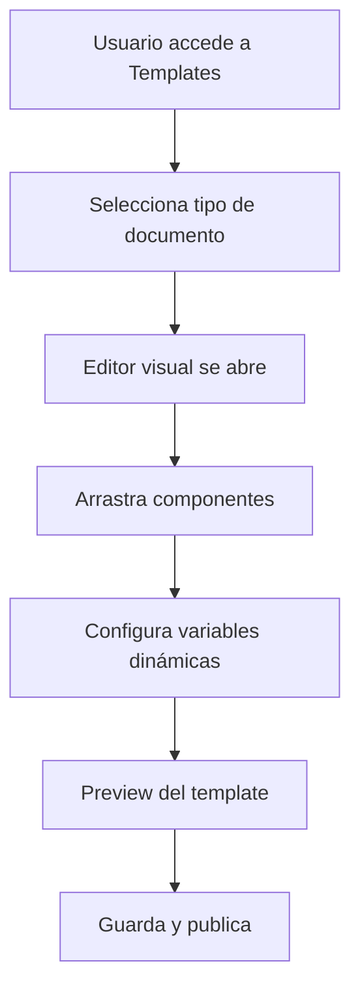
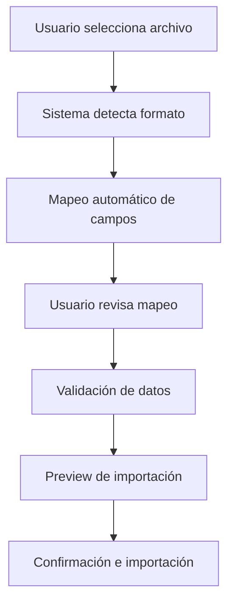
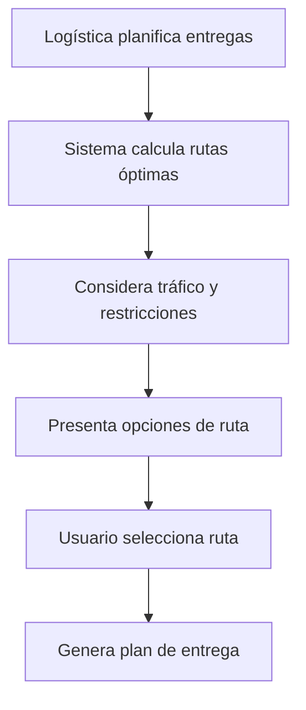

# Requerimientos de Funcionalidades Avanzadas - Sistema de Almacén

## 1. Resumen Ejecutivo

Este documento define los requerimientos para las funcionalidades avanzadas del sistema de almacén, enfocándose en personalización, automatización y mejoras de experiencia de usuario específicas por rol.

## 2. Funcionalidades Core

### 2.1 Templates Personalizables

**Objetivo**: Permitir la creación y personalización de plantillas para reportes y documentos.

**Características principales**:
- Editor visual de plantillas con drag & drop
- Biblioteca de componentes predefinidos (tablas, gráficos, logos)
- Variables dinámicas para datos en tiempo real
- Versionado y control de cambios de plantillas
- Compartir plantillas entre usuarios y roles

### 2.2 Importación Masiva Mejorada

**Objetivo**: Ampliar las capacidades de importación para soportar múltiples formatos de datos.

**Formatos soportados**:
- CSV (Comma Separated Values)
- XML (eXtensible Markup Language)
- JSON (JavaScript Object Notation)
- Excel (.xlsx, .xls)

**Características**:
- Mapeo automático de campos
- Validación de datos en tiempo real
- Preview de importación antes de confirmar
- Manejo de errores y logs detallados
- Importación programada/automática

### 2.3 Funcionalidades Específicas por Rol

#### 2.3.1 Para Coordinación

**Panel de Control Ejecutivo**:
- Dashboard con KPIs principales
- Métricas de rendimiento en tiempo real
- Alertas y notificaciones críticas
- Resumen de estado de todas las obras

**Análisis Comparativo entre Obras**:
- Comparación de consumo de materiales
- Análisis de eficiencia por proyecto
- Benchmarking de costos
- Reportes de desviaciones presupuestarias

**Reportes de Eficiencia por Almacenero**:
- Métricas de productividad individual
- Tiempo promedio de procesamiento
- Precisión en inventarios
- Evaluación de desempeño

#### 2.3.2 Para Logística

**Optimizador de Rutas de Entrega**:
- Algoritmo de optimización de rutas
- Integración con mapas y GPS
- Consideración de tráfico en tiempo real
- Planificación de entregas múltiples

**Comparador de Precios de Proveedores**:
- Base de datos de precios históricos
- Análisis de tendencias de mercado
- Alertas de variaciones significativas
- Recomendaciones de compra

**Gestión de Contratos y Acuerdos Marco**:
- Repositorio centralizado de contratos
- Seguimiento de vencimientos
- Gestión de términos y condiciones
- Alertas de renovación

#### 2.3.3 Para Almaceneros

**App Móvil Simplificada**:
- Interfaz optimizada para dispositivos móviles
- Funcionalidades offline
- Sincronización automática
- Navegación intuitiva

**Listas de Picking Optimizadas**:
- Ordenamiento por ubicación física
- Rutas optimizadas dentro del almacén
- Códigos QR para verificación
- Estado en tiempo real

**Alertas de Ubicación de Materiales**:
- Notificaciones push
- Mapas interactivos del almacén
- Búsqueda por proximidad
- Historial de movimientos

### 2.4 Mejoras de UX/UI

#### 2.4.1 Tema Oscuro
- Modo oscuro completo para toda la aplicación
- Alternancia automática según horario
- Preservación de preferencias por usuario
- Optimización para reducir fatiga visual

#### 2.4.2 Personalización
- Dashboards personalizables por usuario
- Widgets arrastrables y redimensionables
- Configuración de métricas favoritas
- Layouts guardados por rol

#### 2.4.3 Accesibilidad
- Cumplimiento con estándares WCAG 2.1 AA
- Navegación por teclado completa
- Soporte para lectores de pantalla
- Alto contraste y texto escalable

#### 2.4.4 Multiidioma
- Soporte para español, inglés y portugués
- Cambio de idioma en tiempo real
- Localización de fechas y números
- Contenido contextual por región

## 3. Flujos de Usuario Principales

### 3.1 Creación de Template Personalizado

### 3.2 Importación Masiva de Datos

### 3.3 Optimización de Rutas

## 4. Requerimientos Técnicos

### 4.1 Performance
- Tiempo de carga de dashboards < 2 segundos
- Importación de archivos hasta 10MB
- Soporte para 1000+ usuarios concurrentes
- Respuesta de API < 500ms

### 4.2 Seguridad
- Autenticación multifactor opcional
- Encriptación de datos sensibles
- Logs de auditoría completos
- Backup automático diario

### 4.3 Compatibilidad
- Navegadores modernos (Chrome, Firefox, Safari, Edge)
- Dispositivos móviles (iOS 12+, Android 8+)
- Tablets y dispositivos híbridos
- Impresoras térmicas para etiquetas

## 5. Criterios de Aceptación

### 5.1 Templates
- [ ] Usuario puede crear template desde cero
- [ ] Sistema incluye 10+ templates predefinidos
- [ ] Variables dinámicas se actualizan correctamente
- [ ] Export a PDF/Excel funciona sin errores

### 5.2 Importación
- [ ] Soporte completo para CSV, XML, JSON
- [ ] Validación detecta 95%+ de errores
- [ ] Proceso de importación es reversible
- [ ] Logs detallados de cada importación

### 5.3 Funcionalidades por Rol
- [ ] Cada rol ve solo funciones relevantes
- [ ] Dashboards cargan en < 3 segundos
- [ ] App móvil funciona offline
- [ ] Optimizador reduce tiempo de ruta en 20%+

### 5.4 UX/UI
- [ ] Tema oscuro disponible en toda la app
- [ ] Personalización se guarda por usuario
- [ ] Cumple WCAG 2.1 AA al 100%
- [ ] Cambio de idioma sin recargar página

## 6. Plan de Implementación

### Fase 1 (4 semanas)
- Templates básicos y editor visual
- Importación CSV/Excel mejorada
- Tema oscuro

### Fase 2 (6 semanas)
- Funcionalidades específicas por rol
- Dashboards personalizables
- App móvil básica

### Fase 3 (4 semanas)
- Optimizador de rutas
- Soporte XML/JSON
- Multiidioma completo

### Fase 4 (2 semanas)
- Accesibilidad completa
- Optimizaciones de performance
- Testing y refinamiento

## 7. Riesgos y Mitigaciones

| Riesgo | Probabilidad | Impacto | Mitigación |
|--------|--------------|---------|------------|
| Complejidad del editor visual | Media | Alto | Usar biblioteca existente (GrapesJS) |
| Performance con grandes datasets | Alta | Medio | Implementar paginación y lazy loading |
| Compatibilidad móvil | Baja | Alto | Testing extensivo en dispositivos reales |
| Adopción por usuarios | Media | Alto | Training y documentación completa |

## 8. Métricas de Éxito

- **Adopción**: 80%+ de usuarios activos usan nuevas funcionalidades
- **Eficiencia**: 30% reducción en tiempo de generación de reportes
- **Satisfacción**: Score NPS > 8.0
- **Performance**: 99.5% uptime del sistema
- **Errores**: < 0.1% tasa de error en importaciones