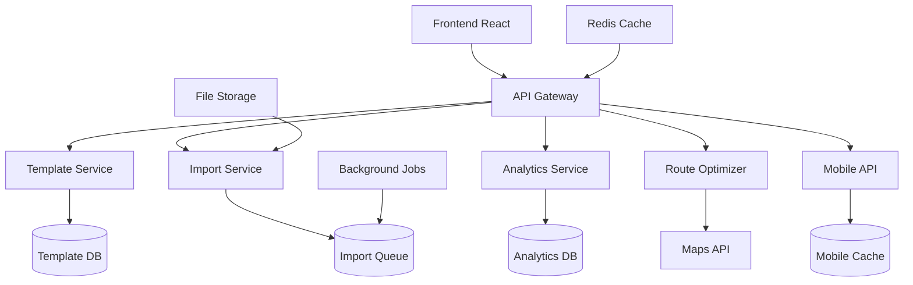

# Arquitectura Técnica - Funcionalidades Avanzadas

## 1. Arquitectura General



## 2. Stack Tecnológico

### 2.1 Frontend
- **Framework**: React 18 + TypeScript
- **UI Library**: Tailwind CSS + Headless UI
- **State Management**: Zustand
- **Charts**: Recharts + D3.js
- **Editor**: GrapesJS (template editor)
- **Mobile**: React Native (futuro)

### 2.2 Backend
- **Runtime**: Node.js + Express
- **Database**: Supabase (PostgreSQL)
- **File Storage**: Supabase Storage
- **Cache**: Redis
- **Queue**: Bull Queue
- **Maps**: Google Maps API / OpenStreetMap

### 2.3 Servicios Adicionales
- **PDF Generation**: Puppeteer
- **Excel Processing**: ExcelJS
- **XML/JSON Parser**: Native + Joi validation
- **Image Processing**: Sharp
- **Notifications**: Web Push API

## 3. Esquema de Base de Datos

### 3.1 Templates System

```sql
-- Tabla de templates
CREATE TABLE report_templates (
    id UUID PRIMARY KEY DEFAULT gen_random_uuid(),
    name VARCHAR(255) NOT NULL,
    description TEXT,
    category VARCHAR(100) NOT NULL, -- 'report', 'document', 'label'
    template_data JSONB NOT NULL, -- Estructura del template
    variables JSONB, -- Variables disponibles
    is_public BOOLEAN DEFAULT false,
    created_by UUID REFERENCES usuarios(id),
    created_at TIMESTAMP WITH TIME ZONE DEFAULT NOW(),
    updated_at TIMESTAMP WITH TIME ZONE DEFAULT NOW(),
    version INTEGER DEFAULT 1
);

-- Tabla de instancias de templates generados
CREATE TABLE template_instances (
    id UUID PRIMARY KEY DEFAULT gen_random_uuid(),
    template_id UUID REFERENCES report_templates(id),
    generated_by UUID REFERENCES usuarios(id),
    data_context JSONB, -- Datos usados para generar
    output_format VARCHAR(20), -- 'pdf', 'excel', 'html'
    file_url TEXT,
    generated_at TIMESTAMP WITH TIME ZONE DEFAULT NOW()
);

-- Índices para templates
CREATE INDEX idx_templates_category ON report_templates(category);
CREATE INDEX idx_templates_created_by ON report_templates(created_by);
CREATE INDEX idx_template_instances_template_id ON template_instances(template_id);
```

### 3.2 Import System

```sql
-- Tabla de trabajos de importación
CREATE TABLE import_jobs (
    id UUID PRIMARY KEY DEFAULT gen_random_uuid(),
    file_name VARCHAR(255) NOT NULL,
    file_size BIGINT,
    file_type VARCHAR(50), -- 'csv', 'xml', 'json', 'excel'
    target_table VARCHAR(100), -- tabla destino
    status VARCHAR(20) DEFAULT 'pending', -- 'pending', 'processing', 'completed', 'failed'
    total_records INTEGER,
    processed_records INTEGER DEFAULT 0,
    failed_records INTEGER DEFAULT 0,
    mapping_config JSONB, -- Configuración de mapeo de campos
    validation_rules JSONB, -- Reglas de validación
    error_log JSONB, -- Log de errores
    created_by UUID REFERENCES usuarios(id),
    created_at TIMESTAMP WITH TIME ZONE DEFAULT NOW(),
    completed_at TIMESTAMP WITH TIME ZONE
);

-- Tabla de registros de importación fallidos
CREATE TABLE import_errors (
    id UUID PRIMARY KEY DEFAULT gen_random_uuid(),
    import_job_id UUID REFERENCES import_jobs(id),
    row_number INTEGER,
    field_name VARCHAR(100),
    error_type VARCHAR(50),
    error_message TEXT,
    raw_data JSONB
);

-- Índices para importación
CREATE INDEX idx_import_jobs_status ON import_jobs(status);
CREATE INDEX idx_import_jobs_created_by ON import_jobs(created_by);
CREATE INDEX idx_import_errors_job_id ON import_errors(import_job_id);
```

### 3.3 Analytics & Dashboards

```sql
-- Tabla de configuraciones de dashboard personalizados
CREATE TABLE user_dashboards (
    id UUID PRIMARY KEY DEFAULT gen_random_uuid(),
    user_id UUID REFERENCES usuarios(id),
    name VARCHAR(255) NOT NULL,
    layout JSONB NOT NULL, -- Configuración de widgets y layout
    is_default BOOLEAN DEFAULT false,
    created_at TIMESTAMP WITH TIME ZONE DEFAULT NOW(),
    updated_at TIMESTAMP WITH TIME ZONE DEFAULT NOW()
);

-- Tabla de métricas calculadas para performance
CREATE TABLE calculated_metrics (
    id UUID PRIMARY KEY DEFAULT gen_random_uuid(),
    metric_type VARCHAR(100) NOT NULL, -- 'efficiency', 'consumption', 'cost'
    entity_type VARCHAR(50), -- 'user', 'obra', 'material'
    entity_id UUID,
    period_start DATE,
    period_end DATE,
    metric_value DECIMAL(15,4),
    metadata JSONB,
    calculated_at TIMESTAMP WITH TIME ZONE DEFAULT NOW()
);

-- Tabla de configuraciones de usuario
CREATE TABLE user_preferences (
    id UUID PRIMARY KEY DEFAULT gen_random_uuid(),
    user_id UUID REFERENCES usuarios(id) UNIQUE,
    theme VARCHAR(20) DEFAULT 'light', -- 'light', 'dark', 'auto'
    language VARCHAR(10) DEFAULT 'es', -- 'es', 'en', 'pt'
    timezone VARCHAR(50) DEFAULT 'America/Lima',
    dashboard_config JSONB,
    notification_settings JSONB,
    accessibility_settings JSONB,
    created_at TIMESTAMP WITH TIME ZONE DEFAULT NOW(),
    updated_at TIMESTAMP WITH TIME ZONE DEFAULT NOW()
);

-- Índices para analytics
CREATE INDEX idx_user_dashboards_user_id ON user_dashboards(user_id);
CREATE INDEX idx_calculated_metrics_type_entity ON calculated_metrics(metric_type, entity_type, entity_id);
CREATE INDEX idx_calculated_metrics_period ON calculated_metrics(period_start, period_end);
```

### 3.4 Route Optimization

```sql
-- Tabla de rutas optimizadas
CREATE TABLE delivery_routes (
    id UUID PRIMARY KEY DEFAULT gen_random_uuid(),
    name VARCHAR(255),
    created_by UUID REFERENCES usuarios(id),
    route_date DATE,
    vehicle_type VARCHAR(50),
    max_capacity DECIMAL(10,2),
    start_location JSONB, -- {lat, lng, address}
    waypoints JSONB, -- Array de puntos de entrega
    optimized_order JSONB, -- Orden optimizado
    total_distance DECIMAL(10,2), -- en km
    estimated_time INTEGER, -- en minutos
    status VARCHAR(20) DEFAULT 'planned', -- 'planned', 'in_progress', 'completed'
    created_at TIMESTAMP WITH TIME ZONE DEFAULT NOW(),
    updated_at TIMESTAMP WITH TIME ZONE DEFAULT NOW()
);

-- Tabla de entregas en ruta
CREATE TABLE route_deliveries (
    id UUID PRIMARY KEY DEFAULT gen_random_uuid(),
    route_id UUID REFERENCES delivery_routes(id),
    delivery_order INTEGER,
    obra_id UUID REFERENCES obras(id),
    materials JSONB, -- Array de materiales a entregar
    estimated_arrival TIMESTAMP WITH TIME ZONE,
    actual_arrival TIMESTAMP WITH TIME ZONE,
    delivery_status VARCHAR(20) DEFAULT 'pending',
    notes TEXT
);

-- Índices para rutas
CREATE INDEX idx_delivery_routes_date ON delivery_routes(route_date);
CREATE INDEX idx_delivery_routes_status ON delivery_routes(status);
CREATE INDEX idx_route_deliveries_route_id ON route_deliveries(route_id);
```

### 3.5 Supplier Management

```sql
-- Tabla de comparación de precios
CREATE TABLE supplier_price_history (
    id UUID PRIMARY KEY DEFAULT gen_random_uuid(),
    supplier_id UUID, -- Referencia a proveedores
    material_id UUID REFERENCES materiales(id),
    price DECIMAL(12,4),
    currency VARCHAR(3) DEFAULT 'PEN',
    valid_from DATE,
    valid_until DATE,
    minimum_quantity DECIMAL(10,2),
    lead_time_days INTEGER,
    terms_conditions TEXT,
    created_at TIMESTAMP WITH TIME ZONE DEFAULT NOW()
);

-- Tabla de contratos marco
CREATE TABLE framework_contracts (
    id UUID PRIMARY KEY DEFAULT gen_random_uuid(),
    contract_number VARCHAR(100) UNIQUE,
    supplier_id UUID,
    contract_type VARCHAR(50), -- 'framework', 'blanket', 'annual'
    start_date DATE,
    end_date DATE,
    total_value DECIMAL(15,2),
    currency VARCHAR(3) DEFAULT 'PEN',
    terms JSONB, -- Términos y condiciones estructurados
    materials_covered JSONB, -- Array de materiales cubiertos
    status VARCHAR(20) DEFAULT 'active',
    created_by UUID REFERENCES usuarios(id),
    created_at TIMESTAMP WITH TIME ZONE DEFAULT NOW(),
    updated_at TIMESTAMP WITH TIME ZONE DEFAULT NOW()
);

-- Índices para proveedores
CREATE INDEX idx_price_history_material_date ON supplier_price_history(material_id, valid_from);
CREATE INDEX idx_framework_contracts_dates ON framework_contracts(start_date, end_date);
CREATE INDEX idx_framework_contracts_status ON framework_contracts(status);
```

## 4. Servicios Backend

### 4.1 Template Service

```typescript
// src/services/templateService.ts
export class TemplateService {
  // Crear nuevo template
  async createTemplate(templateData: CreateTemplateRequest): Promise<Template> {
    const template = await supabase
      .from('report_templates')
      .insert({
        name: templateData.name,
        description: templateData.description,
        category: templateData.category,
        template_data: templateData.templateData,
        variables: templateData.variables,
        created_by: templateData.userId
      })
      .select()
      .single();
    
    return template.data;
  }

  // Generar documento desde template
  async generateDocument(templateId: string, data: any, format: 'pdf' | 'excel' | 'html'): Promise<string> {
    const template = await this.getTemplate(templateId);
    
    switch (format) {
      case 'pdf':
        return await this.generatePDF(template, data);
      case 'excel':
        return await this.generateExcel(template, data);
      case 'html':
        return await this.generateHTML(template, data);
    }
  }

  // Procesar variables dinámicas
  private async processVariables(template: Template, data: any): Promise<any> {
    const processedData = { ...data };
    
    // Procesar variables calculadas
    for (const variable of template.variables) {
      if (variable.type === 'calculated') {
        processedData[variable.name] = await this.calculateVariable(variable, data);
      }
    }
    
    return processedData;
  }
}
```

### 4.2 Import Service

```typescript
// src/services/importService.ts
export class ImportService {
  // Procesar archivo de importación
  async processImport(file: File, config: ImportConfig): Promise<ImportJob> {
    const job = await this.createImportJob(file, config);
    
    // Procesar en background
    await this.queueImportJob(job.id);
    
    return job;
  }

  // Procesar diferentes formatos
  async processFile(jobId: string): Promise<void> {
    const job = await this.getImportJob(jobId);
    const fileContent = await this.downloadFile(job.file_url);
    
    let records: any[];
    
    switch (job.file_type) {
      case 'csv':
        records = await this.parseCSV(fileContent);
        break;
      case 'xml':
        records = await this.parseXML(fileContent);
        break;
      case 'json':
        records = await this.parseJSON(fileContent);
        break;
      case 'excel':
        records = await this.parseExcel(fileContent);
        break;
    }
    
    await this.validateAndImport(job, records);
  }

  // Validar datos antes de importar
  private async validateAndImport(job: ImportJob, records: any[]): Promise<void> {
    const validRecords = [];
    const errors = [];
    
    for (let i = 0; i < records.length; i++) {
      const record = records[i];
      const validation = await this.validateRecord(record, job.validation_rules);
      
      if (validation.isValid) {
        validRecords.push(this.mapRecord(record, job.mapping_config));
      } else {
        errors.push({
          row_number: i + 1,
          errors: validation.errors
        });
      }
    }
    
    // Importar registros válidos
    await this.bulkInsert(job.target_table, validRecords);
    
    // Guardar errores
    if (errors.length > 0) {
      await this.saveImportErrors(job.id, errors);
    }
    
    // Actualizar estado del job
    await this.updateJobStatus(job.id, 'completed', validRecords.length, errors.length);
  }
}
```

### 4.3 Analytics Service

```typescript
// src/services/analyticsService.ts
export class AnalyticsService {
  // Calcular métricas de eficiencia por almacenero
  async calculateWarehouseEfficiency(userId: string, period: DateRange): Promise<EfficiencyMetrics> {
    const metrics = await supabase.rpc('calculate_user_efficiency', {
      user_id: userId,
      start_date: period.start,
      end_date: period.end
    });
    
    return {
      processingTime: metrics.avg_processing_time,
      accuracy: metrics.inventory_accuracy,
      productivity: metrics.items_per_hour,
      errorRate: metrics.error_rate
    };
  }

  // Análisis comparativo entre obras
  async compareProjects(projectIds: string[], metrics: string[]): Promise<ProjectComparison> {
    const comparisons = [];
    
    for (const projectId of projectIds) {
      const projectMetrics = await this.getProjectMetrics(projectId, metrics);
      comparisons.push({
        projectId,
        metrics: projectMetrics
      });
    }
    
    return {
      projects: comparisons,
      benchmarks: this.calculateBenchmarks(comparisons),
      insights: this.generateInsights(comparisons)
    };
  }

  // Generar dashboard personalizado
  async generateDashboard(userId: string, config: DashboardConfig): Promise<DashboardData> {
    const widgets = [];
    
    for (const widgetConfig of config.widgets) {
      const widgetData = await this.generateWidget(widgetConfig, userId);
      widgets.push(widgetData);
    }
    
    return {
      widgets,
      lastUpdated: new Date(),
      refreshInterval: config.refreshInterval
    };
  }
}
```

### 4.4 Route Optimizer Service

```typescript
// src/services/routeOptimizerService.ts
export class RouteOptimizerService {
  // Optimizar ruta de entregas
  async optimizeRoute(deliveries: DeliveryPoint[], constraints: RouteConstraints): Promise<OptimizedRoute> {
    // Obtener matriz de distancias
    const distanceMatrix = await this.getDistanceMatrix(deliveries);
    
    // Aplicar algoritmo de optimización (TSP con restricciones)
    const optimizedOrder = await this.solveTSP(distanceMatrix, constraints);
    
    // Calcular métricas de la ruta
    const routeMetrics = this.calculateRouteMetrics(optimizedOrder, distanceMatrix);
    
    return {
      waypoints: optimizedOrder,
      totalDistance: routeMetrics.distance,
      estimatedTime: routeMetrics.time,
      fuelCost: routeMetrics.fuelCost,
      optimizationSavings: routeMetrics.savings
    };
  }

  // Algoritmo TSP simplificado con restricciones
  private async solveTSP(matrix: number[][], constraints: RouteConstraints): Promise<DeliveryPoint[]> {
    // Implementación de algoritmo genético o nearest neighbor con mejoras
    // Considerando restricciones de tiempo, capacidad, etc.
    
    let bestRoute = this.nearestNeighborHeuristic(matrix);
    bestRoute = this.improveWith2Opt(bestRoute, matrix);
    
    return this.applyConstraints(bestRoute, constraints);
  }

  // Integración con APIs de mapas
  private async getDistanceMatrix(points: DeliveryPoint[]): Promise<number[][]> {
    // Usar Google Maps Distance Matrix API o similar
    const response = await fetch(`https://maps.googleapis.com/maps/api/distancematrix/json`, {
      method: 'POST',
      body: JSON.stringify({
        origins: points.map(p => `${p.lat},${p.lng}`),
        destinations: points.map(p => `${p.lat},${p.lng}`),
        units: 'metric',
        mode: 'driving'
      })
    });
    
    return this.parseDistanceMatrix(await response.json());
  }
}
```

## 5. Componentes Frontend

### 5.1 Template Editor Component

```typescript
// src/components/TemplateEditor.tsx
import { useEffect, useRef } from 'react';
import 'grapesjs/dist/css/grapes.min.css';

interface TemplateEditorProps {
  template?: Template;
  onSave: (templateData: any) => void;
}

export const TemplateEditor: React.FC<TemplateEditorProps> = ({ template, onSave }) => {
  const editorRef = useRef<HTMLDivElement>(null);
  const editorInstance = useRef<any>(null);

  useEffect(() => {
    if (editorRef.current && !editorInstance.current) {
      // Inicializar GrapesJS
      editorInstance.current = grapesjs.init({
        container: editorRef.current,
        plugins: ['gjs-blocks-basic', 'gjs-plugin-forms'],
        pluginsOpts: {
          'gjs-blocks-basic': { flexGrid: true },
        },
        blockManager: {
          appendTo: '.blocks-container',
        },
        panels: {
          defaults: [
            {
              id: 'basic-actions',
              el: '.panel__basic-actions',
              buttons: [
                {
                  id: 'visibility',
                  active: true,
                  className: 'btn-toggle-borders',
                  label: '<i class="fa fa-clone"></i>',
                  command: 'sw-visibility',
                },
                {
                  id: 'export',
                  className: 'btn-open-export',
                  label: '<i class="fa fa-code"></i>',
                  command: 'export-template',
                  context: 'export-template',
                },
                {
                  id: 'show-json',
                  className: 'btn-show-json',
                  label: '<i class="fa fa-file-code-o"></i>',
                  context: 'show-json',
                  command(editor: any) {
                    editor.Modal.setTitle('Components JSON')
                      .setContent(`<textarea style="width:100%; height: 250px;">
                        ${JSON.stringify(editor.getComponents())}
                      </textarea>`)
                      .open();
                  },
                }
              ],
            },
          ],
        },
      });

      // Cargar template existente
      if (template) {
        editorInstance.current.setComponents(template.template_data.components);
        editorInstance.current.setStyle(template.template_data.styles);
      }

      // Agregar bloques personalizados
      editorInstance.current.BlockManager.add('dynamic-text', {
        label: 'Texto Dinámico',
        content: '<div data-variable="{{variable_name}}">Texto dinámico</div>',
        category: 'Dinámico'
      });

      editorInstance.current.BlockManager.add('data-table', {
        label: 'Tabla de Datos',
        content: '<table data-source="{{table_source}}"><tr><th>Columna 1</th></tr></table>',
        category: 'Dinámico'
      });
    }

    return () => {
      if (editorInstance.current) {
        editorInstance.current.destroy();
      }
    };
  }, []);

  const handleSave = () => {
    if (editorInstance.current) {
      const templateData = {
        components: editorInstance.current.getComponents(),
        styles: editorInstance.current.getCss(),
        html: editorInstance.current.getHtml()
      };
      onSave(templateData);
    }
  };

  return (
    <div className="template-editor">
      <div className="editor-header">
        <div className="panel__basic-actions"></div>
        <button onClick={handleSave} className="btn btn-primary">
          Guardar Template
        </button>
      </div>
      
      <div className="editor-container">
        <div className="blocks-container"></div>
        <div ref={editorRef} className="editor-canvas"></div>
        <div className="styles-container"></div>
      </div>
    </div>
  );
};
```

### 5.2 Import Wizard Component

```typescript
// src/components/ImportWizard.tsx
import { useState } from 'react';
import { useDropzone } from 'react-dropzone';

interface ImportWizardProps {
  onComplete: (result: ImportResult) => void;
}

export const ImportWizard: React.FC<ImportWizardProps> = ({ onComplete }) => {
  const [step, setStep] = useState(1);
  const [file, setFile] = useState<File | null>(null);
  const [mapping, setMapping] = useState<FieldMapping[]>([]);
  const [preview, setPreview] = useState<any[]>([]);

  const { getRootProps, getInputProps, isDragActive } = useDropzone({
    accept: {
      'text/csv': ['.csv'],
      'application/json': ['.json'],
      'application/xml': ['.xml'],
      'application/vnd.openxmlformats-officedocument.spreadsheetml.sheet': ['.xlsx']
    },
    onDrop: (acceptedFiles) => {
      if (acceptedFiles.length > 0) {
        setFile(acceptedFiles[0]);
        analyzeFile(acceptedFiles[0]);
        setStep(2);
      }
    }
  });

  const analyzeFile = async (file: File) => {
    const formData = new FormData();
    formData.append('file', file);
    
    const response = await fetch('/api/import/analyze', {
      method: 'POST',
      body: formData
    });
    
    const analysis = await response.json();
    setMapping(analysis.suggestedMapping);
    setPreview(analysis.preview);
  };

  const handleImport = async () => {
    if (!file) return;
    
    const importConfig = {
      file,
      mapping,
      targetTable: 'materiales', // o la tabla seleccionada
      validationRules: getValidationRules()
    };
    
    const result = await ImportService.processImport(file, importConfig);
    onComplete(result);
  };

  return (
    <div className="import-wizard">
      {step === 1 && (
        <div className="step-file-upload">
          <h2>Seleccionar Archivo</h2>
          <div {...getRootProps()} className={`dropzone ${isDragActive ? 'active' : ''}`}>
            <input {...getInputProps()} />
            <div className="dropzone-content">
              <i className="fas fa-cloud-upload-alt text-4xl text-gray-400 mb-4"></i>
              <p>Arrastra tu archivo aquí o haz clic para seleccionar</p>
              <p className="text-sm text-gray-500">Soporta CSV, JSON, XML, Excel</p>
            </div>
          </div>
        </div>
      )}

      {step === 2 && (
        <div className="step-mapping">
          <h2>Mapeo de Campos</h2>
          <div className="mapping-container">
            <div className="source-fields">
              <h3>Campos del Archivo</h3>
              {mapping.map((field, index) => (
                <div key={index} className="field-mapping">
                  <span className="source-field">{field.sourceField}</span>
                  <select 
                    value={field.targetField}
                    onChange={(e) => updateMapping(index, e.target.value)}
                    className="target-select"
                  >
                    <option value="">-- Seleccionar --</option>
                    <option value="codigo">Código</option>
                    <option value="nombre">Nombre</option>
                    <option value="unidad">Unidad</option>
                    <option value="precio">Precio</option>
                  </select>
                </div>
              ))}
            </div>
            
            <div className="preview-data">
              <h3>Vista Previa</h3>
              <table className="preview-table">
                <thead>
                  <tr>
                    {mapping.map((field, index) => (
                      <th key={index}>{field.targetField || field.sourceField}</th>
                    ))}
                  </tr>
                </thead>
                <tbody>
                  {preview.slice(0, 5).map((row, index) => (
                    <tr key={index}>
                      {mapping.map((field, fieldIndex) => (
                        <td key={fieldIndex}>{row[field.sourceField]}</td>
                      ))}
                    </tr>
                  ))}
                </tbody>
              </table>
            </div>
          </div>
          
          <div className="wizard-actions">
            <button onClick={() => setStep(1)} className="btn btn-secondary">
              Atrás
            </button>
            <button onClick={() => setStep(3)} className="btn btn-primary">
              Continuar
            </button>
          </div>
        </div>
      )}

      {step === 3 && (
        <div className="step-validation">
          <h2>Validación y Confirmación</h2>
          <div className="validation-summary">
            <div className="stat">
              <span className="stat-value">{preview.length}</span>
              <span className="stat-label">Registros totales</span>
            </div>
            <div className="stat">
              <span className="stat-value text-green-600">{getValidRecords()}</span>
              <span className="stat-label">Registros válidos</span>
            </div>
            <div className="stat">
              <span className="stat-value text-red-600">{getInvalidRecords()}</span>
              <span className="stat-label">Registros con errores</span>
            </div>
          </div>
          
          <div className="wizard-actions">
            <button onClick={() => setStep(2)} className="btn btn-secondary">
              Atrás
            </button>
            <button onClick={handleImport} className="btn btn-primary">
              Importar Datos
            </button>
          </div>
        </div>
      )}
    </div>
  );
};
```

## 6. Plan de Implementación por Fases

### Fase 1: Fundación (4 semanas)
- [ ] Configurar esquemas de base de datos
- [ ] Implementar Template Service básico
- [ ] Crear Template Editor con GrapesJS
- [ ] Implementar tema oscuro
- [ ] Mejorar Import Service para CSV/Excel

### Fase 2: Funcionalidades Core (6 semanas)
- [ ] Completar Analytics Service
- [ ] Implementar dashboards personalizables
- [ ] Crear funcionalidades específicas por rol
- [ ] Desarrollar app móvil básica (React Native)
- [ ] Implementar sistema de preferencias de usuario

### Fase 3: Optimización y Integración (4 semanas)
- [ ] Implementar Route Optimizer Service
- [ ] Agregar soporte XML/JSON completo
- [ ] Desarrollar comparador de precios
- [ ] Implementar sistema multiidioma
- [ ] Optimizar performance y caching

### Fase 4: Pulimiento y Accesibilidad (2 semanas)
- [ ] Implementar accesibilidad WCAG 2.1
- [ ] Testing exhaustivo en dispositivos
- [ ] Optimizaciones finales de UX
- [ ] Documentación y training
- [ ] Deploy y monitoreo

## 7. Consideraciones de Performance

### 7.1 Frontend
- **Code Splitting**: Cargar componentes bajo demanda
- **Lazy Loading**: Imágenes y datos paginados
- **Memoization**: React.memo y useMemo para componentes pesados
- **Virtual Scrolling**: Para listas grandes de datos

### 7.2 Backend
- **Database Indexing**: Índices optimizados para consultas frecuentes
- **Caching**: Redis para datos calculados y consultas frecuentes
- **Background Jobs**: Procesamiento asíncrono para importaciones
- **Connection Pooling**: Optimizar conexiones a base de datos

### 7.3 Monitoreo
- **APM**: Application Performance Monitoring
- **Logging**: Logs estructurados para debugging
- **Metrics**: Métricas de negocio y técnicas
- **Alerting**: Alertas proactivas para problemas

## 8. Seguridad y Compliance

### 8.1 Autenticación y Autorización
- **JWT Tokens**: Con refresh token rotation
- **Role-based Access**: Permisos granulares por funcionalidad
- **API Rate Limiting**: Prevenir abuso de APIs
- **Input Validation**: Validación estricta en frontend y backend

### 8.2 Protección de Datos
- **Encryption**: Datos sensibles encriptados en reposo
- **HTTPS**: Comunicación segura obligatoria
- **Audit Logs**: Registro de todas las acciones críticas
- **Data Backup**: Backups automáticos y encriptados

### 8.3 Compliance
- **GDPR**: Manejo de datos personales
- **SOX**: Controles para datos financieros
- **ISO 27001**: Estándares de seguridad de información
- **Local Regulations**: Cumplimiento con normativas locales