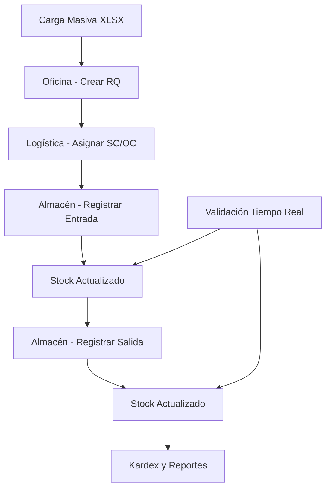

# Documento de Requerimientos del Producto - Sistema de Almacén de Obra

## 1. Descripción General del Producto

Sistema integral de gestión de almacén para obras de construcción que permite el control de inventarios, trazabilidad de materiales y gestión de requerimientos en tiempo real.

El sistema resuelve la necesidad de controlar eficientemente las entradas y salidas de materiales en obras, manteniendo trazabilidad completa desde la solicitud hasta la entrega, con integración en tiempo real entre oficina, logística y almacén.

Objetivo: Optimizar la gestión de inventarios en obras de construcción mediante un sistema digitalizado que reduzca pérdidas, mejore la trazabilidad y facilite la toma de decisiones.

## 2. Características Principales

### 2.1 Roles de Usuario

| Rol | Método de Registro | Permisos Principales |
|-----|-------------------|---------------------|
| COORDINACION | Asignación por administrador | Permisos totales: catálogos, RQ, SC/OC, movimientos, ajustes |
| LOGISTICA | Asignación por coordinación | Asigna/edita SC/OC/Proveedor, lectura global de datos |
| ALMACENERO | Asignación por coordinación | Registra Entradas/Salidas de su obra, consulta stock/kardex |

### 2.2 Módulos Funcionales

Nuestro sistema de almacén consta de las siguientes páginas principales:

1. **Oficina - Gestión de Requerimientos**: formato tabla con 19 columnas, carga masiva XLSX, filtros avanzados
2. **Logística - Asignación SC/OC**: buscador por obra/proveedor/estado, edición con auditoría
3. **Almacén - Entradas**: búsqueda por SC, listado de líneas, captura de cantidades atendidas
4. **Almacén - Salidas**: filtros por solicitante/RQ/material, panel de stock, validación de disponibilidad
5. **Stock y Kardex**: búsqueda avanzada, historial de movimientos, exportación de reportes

### 2.3 Detalles de Páginas

| Página | Módulo | Descripción de Funcionalidades |
|--------|--------|---------------------------------|
| Oficina - RQ | Gestión de Requerimientos | CRUD completo con 19 columnas (BLOQUE, EMPRESA, TIPO, MATERIAL, CÓDIGO, DESCRIPCIÓN, N° REQ., FECHA SOL., FECHA ATENCIÓN, UNIDAD, CANTIDAD, CANT. ATENDIDA, SOLICITANTE, N° SOLICITUD DE COMPRA, ORDEN DE COMPRA, PROVEEDOR, ESTADO, OBSERVACIONES, P.U., SUBTOTAL). Carga masiva XLSX con mapeo de columnas. Filtros por obra, fechas, estado, texto libre |
| Oficina - RQ | Tiempo Real | Suscripción a canal 'rq-rt' para actualización automática de la grilla |
| Logística - SC/OC | Buscador y Asignación | Búsqueda por obra/proveedor/estado. Edición de sc_numero, oc_numero, proveedor con auditoría completa |
| Logística - SC/OC | Tiempo Real | Actualización automática de asignaciones y estados |
| Almacén - Entradas | Búsqueda por SC | Buscar por N° SC, listar líneas con Material, Código, Descripción, Unidad, Cantidad solicitada, RQ, Solicitante |
| Almacén - Entradas | Registro de Entrada | Capturar Cantidad atendida + Observación, check automático de atención, validación atendida ≤ solicitada |
| Almacén - Salidas | Filtros y Búsqueda | Filtros obligatorios por Solicitante, opcionales por N° RQ y Material |
| Almacén - Salidas | Panel de Stock | Mostrar stock disponible (Entradas - Salidas) y líneas vinculables |
| Almacén - Salidas | Registro de Salida | Capturar Cantidad a entregar + Motivo, validación de stock disponible |
| Stock/Kardex | Búsqueda Avanzada | Búsqueda por Material/Código/Descripción/RQ/SC/OC |
| Stock/Kardex | Visualización | Stock actual por obra + historial completo de movimientos |
| Stock/Kardex | Exportación | Exportar reportes en formato CSV/XLSX |

## 3. Proceso Principal

### Flujo de Coordinación
1. Crear y gestionar catálogos de materiales
2. Supervisar todos los requerimientos y movimientos
3. Realizar ajustes de inventario y auditorías
4. Acceso completo a reportes y exportaciones

### Flujo de Oficina
1. Crear requerimientos (RQ) con formato de 19 columnas
2. Cargar requerimientos masivamente desde XLSX
3. Filtrar y buscar requerimientos por múltiples criterios
4. Monitorear estado de atención en tiempo real

### Flujo de Logística
1. Revisar requerimientos pendientes de asignación
2. Asignar números de SC, OC y proveedores
3. Gestionar solicitudes de compra (CRUD)
4. Auditar cambios realizados

### Flujo de Almacenero
1. **Entradas**: Buscar SC → Ver líneas → Registrar cantidades atendidas → Validar y guardar
2. **Salidas**: Filtrar por solicitante → Verificar stock → Registrar cantidad a entregar → Validar stock y entregar
3. **Consultas**: Revisar stock actual y kardex de su obra

## 4. Diseño de Interfaz de Usuario

### 4.1 Estilo de Diseño

- **Colores primarios**: Azul corporativo (#2563eb), Verde éxito (#16a34a)
- **Colores secundarios**: Gris neutro (#6b7280), Rojo alerta (#dc2626)
- **Estilo de botones**: Redondeados con sombra sutil, estados hover y disabled
- **Tipografía**: Inter, tamaños 14px (texto), 16px (labels), 18px (títulos)
- **Layout**: Diseño de tarjetas con navegación superior, sidebar colapsible
- **Iconos**: Heroicons para consistencia, emojis para estados (✅ ❌ ⏳)

### 4.2 Resumen de Diseño de Páginas

| Página | Módulo | Elementos UI |
|--------|--------|--------------|
| Oficina - RQ | Grilla Principal | Tabla responsive con 19 columnas, paginación, filtros en header. Colores: headers azul (#2563eb), filas alternas gris claro (#f9fafb) |
| Oficina - RQ | Carga XLSX | Modal con drag & drop, mapeo de columnas, barra de progreso verde |
| Logística - SC/OC | Buscador | Cards con información de RQ, botones de acción azules, badges de estado |
| Almacén - Entradas | Lista SC | Cards expandibles, inputs numéricos para cantidades, botones de validación |
| Almacén - Salidas | Panel Stock | Indicadores visuales de stock (verde: disponible, amarillo: bajo, rojo: agotado) |
| Stock/Kardex | Tabla Kardex | Tabla con filtros avanzados, gráficos de tendencia, botones de exportación |

### 4.3 Responsividad

Diseño mobile-first con adaptación para tablets y desktop. Optimización táctil para dispositivos móviles en almacén. Navegación colapsible en pantallas pequeñas.
