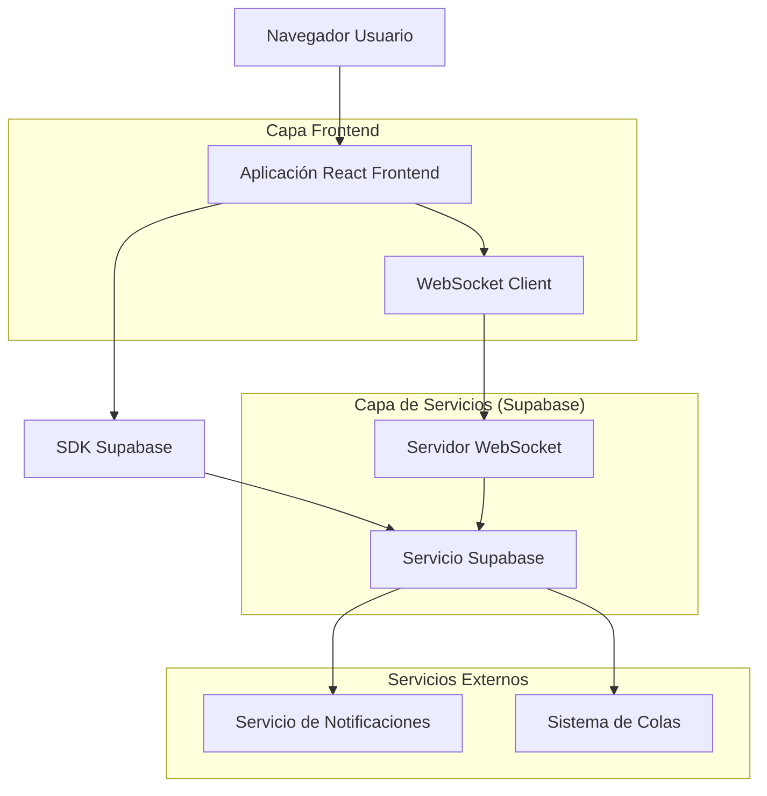
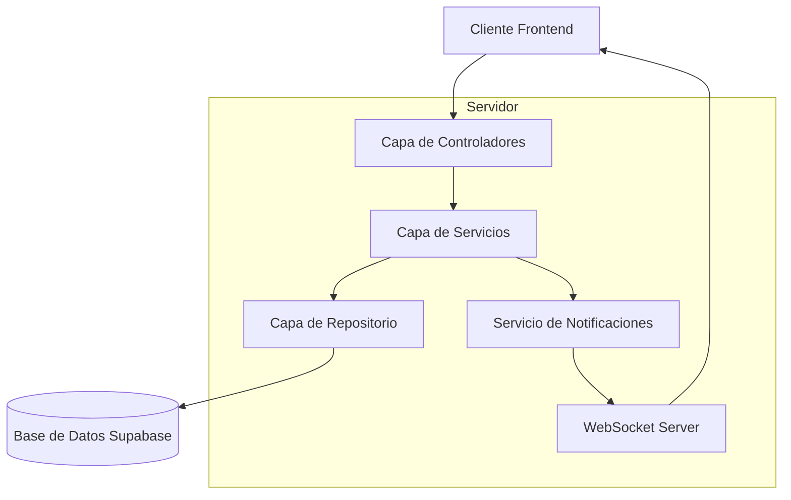
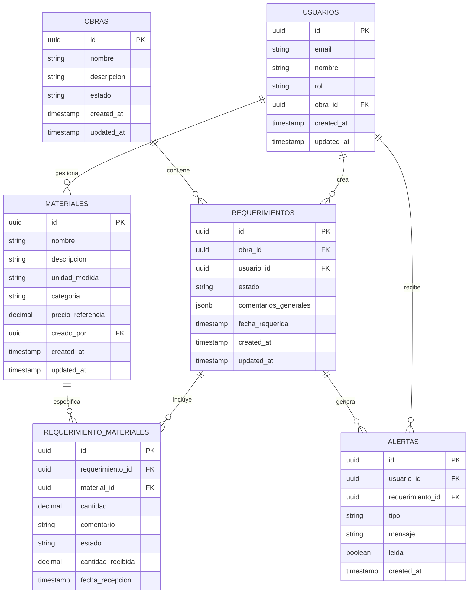

# Sistema de Almacén - Documento de Arquitectura Técnica

## 1. Diseño de Arquitectura



## 2. Descripción de Tecnologías

- Frontend: React@18 + TypeScript + TailwindCSS@3 + Vite
- Backend: Supabase (PostgreSQL + Auth + Realtime)
- Notificaciones: WebSocket + Supabase Realtime
- Estado: Zustand para gestión de estado global
- UI: Lucide React + Headless UI

## 3. Definiciones de Rutas

| Ruta | Propósito |
|------|----------|
| /dashboard | Dashboard principal personalizado por rol |
| /requerimientos | Gestión de requerimientos (crear, listar, seguimiento) |
| /requerimientos/crear | Formulario de creación de requerimientos (Ing. Producción) |
| /requerimientos/seguimiento | Panel de seguimiento de estado (Ing. Producción) |
| /materiales | Catálogo de materiales |
| /materiales/crear | Formulario para crear nuevos materiales (Coordinador) |
| /materiales/editar/:id | Edición de materiales existentes (Coordinador) |
| /stock | Control de inventario actual |
| /entradas | Gestión de recepciones de materiales |
| /salidas | Gestión de despachos |
| /usuarios | Administración de usuarios (Admin/Coordinador) |
| /obras | Administración de obras |
| /reportes | Informes y analytics |
| /perfil | Configuración de usuario y alertas |

## 4. Definiciones de API

### 4.1 APIs Principales

**Gestión de Requerimientos**
```
POST /api/requerimientos
```

Request:
| Parámetro | Tipo | Requerido | Descripción |
|-----------|------|-----------|-------------|
| obra_id | uuid | true | ID de la obra |
| materiales | array | true | Lista de materiales solicitados |
| comentarios | object | false | Comentarios por material |
| usuario_id | uuid | true | ID del ingeniero solicitante |

Response:
| Parámetro | Tipo | Descripción |
|-----------|------|-------------|
| id | uuid | ID del requerimiento creado |
| estado | string | Estado inicial del requerimiento |
| fecha_creacion | timestamp | Fecha de creación |

Ejemplo:
```json
{
  "obra_id": "123e4567-e89b-12d3-a456-426614174000",
  "materiales": [
    {
      "material_id": "456e7890-e89b-12d3-a456-426614174001",
      "cantidad": 100,
      "unidad": "kg"
    }
  ],
  "comentarios": {
    "456e7890-e89b-12d3-a456-426614174001": "Material urgente para estructura"
  }
}
```

**Gestión de Materiales**
```
POST /api/materiales
```

Request:
| Parámetro | Tipo | Requerido | Descripción |
|-----------|------|-----------|-------------|
| nombre | string | true | Nombre del material |
| descripcion | string | false | Descripción detallada |
| unidad_medida | string | true | Unidad de medida |
| categoria | string | true | Categoría del material |
| precio_referencia | decimal | false | Precio de referencia |

**Sistema de Alertas**
```
POST /api/alertas
```

Request:
| Parámetro | Tipo | Requerido | Descripción |
|-----------|------|-----------|-------------|
| usuario_id | uuid | true | ID del usuario destinatario |
| tipo | string | true | Tipo de alerta (material_recibido, stock_bajo, etc.) |
| mensaje | string | true | Contenido de la alerta |
| requerimiento_id | uuid | false | ID del requerimiento relacionado |

### 4.2 WebSocket Events

**Eventos de Notificación en Tiempo Real**
```typescript
// Evento: material_recibido
{
  event: 'material_recibido',
  data: {
    requerimiento_id: string,
    material_id: string,
    cantidad_recibida: number,
    usuario_id: string,
    timestamp: string
  }
}

// Evento: estado_requerimiento_actualizado
{
  event: 'estado_actualizado',
  data: {
    requerimiento_id: string,
    nuevo_estado: string,
    usuario_id: string,
    timestamp: string
  }
}
```

## 5. Arquitectura del Servidor



## 6. Modelo de Datos

### 6.1 Definición del Modelo de Datos



### 6.2 Lenguaje de Definición de Datos

**Tabla de Materiales (materiales)**
```sql
-- Crear tabla de materiales
CREATE TABLE materiales (
    id UUID PRIMARY KEY DEFAULT gen_random_uuid(),
    nombre VARCHAR(255) NOT NULL,
    descripcion TEXT,
    unidad_medida VARCHAR(50) NOT NULL,
    categoria VARCHAR(100) NOT NULL,
    precio_referencia DECIMAL(10,2),
    creado_por UUID REFERENCES usuarios(id),
    created_at TIMESTAMP WITH TIME ZONE DEFAULT NOW(),
    updated_at TIMESTAMP WITH TIME ZONE DEFAULT NOW()
);

-- Crear índices
CREATE INDEX idx_materiales_categoria ON materiales(categoria);
CREATE INDEX idx_materiales_nombre ON materiales(nombre);
CREATE INDEX idx_materiales_creado_por ON materiales(creado_por);

-- Políticas RLS
ALTER TABLE materiales ENABLE ROW LEVEL SECURITY;

CREATE POLICY "Materiales visibles para todos los usuarios autenticados" ON materiales
    FOR SELECT USING (auth.role() = 'authenticated');

CREATE POLICY "Solo COORDINACION puede crear materiales" ON materiales
    FOR INSERT WITH CHECK (
        EXISTS (
            SELECT 1 FROM usuarios 
            WHERE id = auth.uid() 
            AND rol = 'COORDINACION'
        )
    );

CREATE POLICY "Solo COORDINACION puede actualizar materiales" ON materiales
    FOR UPDATE USING (
        EXISTS (
            SELECT 1 FROM usuarios 
            WHERE id = auth.uid() 
            AND rol = 'COORDINACION'
        )
    );
```

**Tabla de Requerimientos Actualizados (requerimientos)**
```sql
-- Actualizar tabla de requerimientos
ALTER TABLE requerimientos ADD COLUMN IF NOT EXISTS comentarios_generales JSONB;
ALTER TABLE requerimientos ADD COLUMN IF NOT EXISTS fecha_requerida TIMESTAMP WITH TIME ZONE;

-- Crear tabla de detalle de requerimientos
CREATE TABLE requerimiento_materiales (
    id UUID PRIMARY KEY DEFAULT gen_random_uuid(),
    requerimiento_id UUID REFERENCES requerimientos(id) ON DELETE CASCADE,
    material_id UUID REFERENCES materiales(id),
    cantidad DECIMAL(10,3) NOT NULL,
    comentario TEXT,
    estado VARCHAR(50) DEFAULT 'pendiente',
    cantidad_recibida DECIMAL(10,3) DEFAULT 0,
    fecha_recepcion TIMESTAMP WITH TIME ZONE,
    created_at TIMESTAMP WITH TIME ZONE DEFAULT NOW(),
    updated_at TIMESTAMP WITH TIME ZONE DEFAULT NOW()
);

-- Crear índices
CREATE INDEX idx_req_materiales_requerimiento ON requerimiento_materiales(requerimiento_id);
CREATE INDEX idx_req_materiales_material ON requerimiento_materiales(material_id);
CREATE INDEX idx_req_materiales_estado ON requerimiento_materiales(estado);

-- Políticas RLS
ALTER TABLE requerimiento_materiales ENABLE ROW LEVEL SECURITY;

CREATE POLICY "Requerimiento materiales visibles según obra" ON requerimiento_materiales
    FOR SELECT USING (
        EXISTS (
            SELECT 1 FROM requerimientos r
            JOIN usuarios u ON u.obra_id = r.obra_id
            WHERE r.id = requerimiento_id
            AND u.id = auth.uid()
        )
    );

CREATE POLICY "PRODUCCION puede crear requerimiento materiales" ON requerimiento_materiales
    FOR INSERT WITH CHECK (
        EXISTS (
            SELECT 1 FROM usuarios 
            WHERE id = auth.uid() 
            AND rol = 'PRODUCCION'
        )
    );
```

**Tabla de Alertas (alertas)**
```sql
-- Crear tabla de alertas
CREATE TABLE alertas (
    id UUID PRIMARY KEY DEFAULT gen_random_uuid(),
    usuario_id UUID REFERENCES usuarios(id) ON DELETE CASCADE,
    requerimiento_id UUID REFERENCES requerimientos(id) ON DELETE CASCADE,
    tipo VARCHAR(50) NOT NULL,
    mensaje TEXT NOT NULL,
    leida BOOLEAN DEFAULT FALSE,
    created_at TIMESTAMP WITH TIME ZONE DEFAULT NOW()
);

-- Crear índices
CREATE INDEX idx_alertas_usuario ON alertas(usuario_id);
CREATE INDEX idx_alertas_tipo ON alertas(tipo);
CREATE INDEX idx_alertas_leida ON alertas(leida);
CREATE INDEX idx_alertas_created_at ON alertas(created_at DESC);

-- Políticas RLS
ALTER TABLE alertas ENABLE ROW LEVEL SECURITY;

CREATE POLICY "Usuarios solo ven sus propias alertas" ON alertas
    FOR SELECT USING (usuario_id = auth.uid());

CREATE POLICY "Sistema puede crear alertas" ON alertas
    FOR INSERT WITH CHECK (true);

CREATE POLICY "Usuarios pueden marcar sus alertas como leídas" ON alertas
    FOR UPDATE USING (usuario_id = auth.uid());
```

**Actualizar tabla de usuarios para nuevo rol**
```sql
-- Actualizar constraint de roles
ALTER TABLE usuarios DROP CONSTRAINT IF EXISTS usuarios_rol_check;
ALTER TABLE usuarios ADD CONSTRAINT usuarios_rol_check 
    CHECK (rol IN ('COORDINACION', 'LOGISTICA', 'ALMACENERO', 'PRODUCCION'));

-- Datos iniciales
INSERT INTO materiales (nombre, descripcion, unidad_medida, categoria, precio_referencia) VALUES
('Cemento Portland', 'Cemento tipo I para construcción general', 'kg', 'Cemento', 0.45),
('Varilla de Acero 3/8"', 'Varilla corrugada de acero para refuerzo', 'm', 'Acero', 2.80),
('Arena Gruesa', 'Arena para mezcla de concreto', 'm3', 'Agregados', 25.00),
('Piedra Chancada 3/4"', 'Agregado grueso para concreto', 'm3', 'Agregados', 35.00),
('Ladrillo King Kong', 'Ladrillo de arcilla para muros', 'unidad', 'Albañilería', 0.85);
```

**Función para generar alertas automáticas**
```sql
-- Función para crear alertas automáticas
CREATE OR REPLACE FUNCTION crear_alerta_material_recibido()
RETURNS TRIGGER AS $$
BEGIN
    -- Crear alerta cuando se actualiza cantidad_recibida
    IF NEW.cantidad_recibida > OLD.cantidad_recibida THEN
        INSERT INTO alertas (usuario_id, requerimiento_id, tipo, mensaje)
        SELECT 
            r.usuario_id,
            NEW.requerimiento_id,
            'material_recibido',
            'Material ' || m.nombre || ' ha sido recibido en almacén. Cantidad: ' || NEW.cantidad_recibida || ' ' || m.unidad_medida
        FROM requerimientos r
        JOIN materiales m ON m.id = NEW.material_id
        WHERE r.id = NEW.requerimiento_id;
    END IF;
    
    RETURN NEW;
END;
$$ LANGUAGE plpgsql;

-- Trigger para alertas automáticas
CREATE TRIGGER trigger_alerta_material_recibido
    AFTER UPDATE ON requerimiento_materiales
    FOR EACH ROW
    EXECUTE FUNCTION crear_alerta_material_recibido();
```