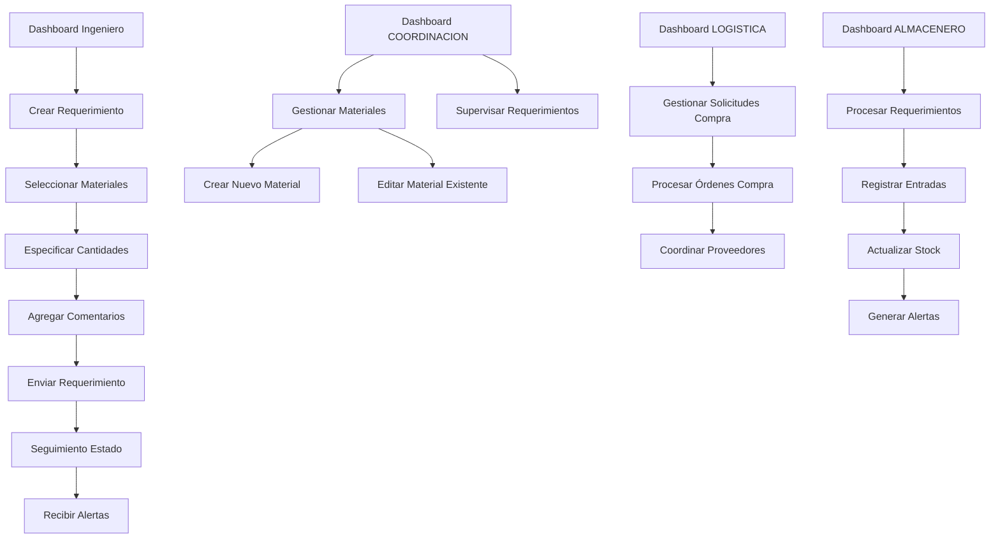

# Sistema de Almacén - Documento de Requerimientos del Producto

## 1. Descripción General del Producto

Sistema integral de gestión de almacén que permite el control de inventarios, requerimientos de materiales y coordinación entre diferentes roles de usuario en proyectos de construcción y producción.

El sistema facilita la gestión eficiente de materiales desde la solicitud hasta la entrega, con seguimiento en tiempo real y notificaciones automáticas para optimizar los procesos de almacén y producción.

## 2. Características Principales

### 2.1 Roles de Usuario

| Rol | Método de Registro | Permisos Principales |
|-----|-------------------|---------------------|
| COORDINACION | Asignación por administrador | Gestión de materiales, creación de nuevos materiales, supervisión de requerimientos |
| LOGISTICA | Asignación por administrador | Gestión de solicitudes de compra, proveedores y órdenes de compra |
| ALMACENERO | Asignación por administrador | Gestión de entradas, salidas, stock y procesamiento de requerimientos |
| PRODUCCION | Asignación por administrador | Creación de requerimientos, seguimiento de estado y recepción de alertas |

### 2.2 Módulos de Funcionalidad

Nuestro sistema de almacén consta de las siguientes páginas principales:

1. **Dashboard Principal**: panel de control personalizado por rol, métricas clave, notificaciones.
2. **Gestión de Requerimientos**: creación, edición, seguimiento y aprobación de requerimientos.
3. **Gestión de Materiales**: catálogo de materiales, creación y edición de nuevos materiales.
4. **Control de Stock**: inventario actual, movimientos, alertas de stock mínimo.
5. **Gestión de Entradas**: registro de recepciones, validación de materiales.
6. **Gestión de Salidas**: despachos, asignación a obras, control de entregas.
7. **Seguimiento y Alertas**: estado de requerimientos, notificaciones automáticas.
8. **Administración de Usuarios**: gestión de roles, permisos y asignaciones.
9. **Administración de Obras**: creación y gestión de proyectos.
10. **Reportes y Analytics**: informes de movimientos, estadísticas de uso.

### 2.3 Detalles de Páginas

| Página | Módulo | Descripción de Funcionalidad |
|--------|--------|-----------------------------|
| Dashboard Principal | Panel de Control | Mostrar métricas personalizadas por rol, notificaciones pendientes, accesos rápidos |
| Dashboard Principal | Alertas y Notificaciones | Mostrar alertas de stock bajo, requerimientos pendientes, materiales recibidos |
| Gestión de Requerimientos | Crear Requerimiento | Seleccionar materiales de lista maestra, especificar cantidades, agregar comentarios opcionales |
| Gestión de Requerimientos | Lista de Requerimientos | Visualizar todos los requerimientos con filtros por estado, fecha, obra |
| Gestión de Requerimientos | Seguimiento de Estado | Mostrar progreso de requerimientos (pendiente, en proceso, recibido, entregado) |
| Gestión de Materiales | Catálogo de Materiales | Listar todos los materiales disponibles con búsqueda y filtros |
| Gestión de Materiales | Crear Material | Formulario para agregar nuevos materiales al catálogo (solo Coordinador) |
| Gestión de Materiales | Editar Material | Modificar información de materiales existentes (solo Coordinador) |
| Control de Stock | Inventario Actual | Mostrar stock disponible por material y ubicación |
| Control de Stock | Movimientos de Stock | Historial de entradas y salidas con detalles |
| Gestión de Entradas | Registrar Entrada | Formulario para registrar recepciones de materiales |
| Gestión de Entradas | Validar Materiales | Verificar calidad y cantidad de materiales recibidos |
| Gestión de Salidas | Procesar Salida | Despachar materiales según requerimientos aprobados |
| Gestión de Salidas | Asignar a Obra | Vincular salidas con obras específicas |
| Seguimiento y Alertas | Estado de Requerimientos | Panel de seguimiento para Ingenieros de Producción |
| Seguimiento y Alertas | Configurar Alertas | Personalizar notificaciones por tipo de evento |
| Administración de Usuarios | Gestión de Usuarios | Crear, editar y asignar roles a usuarios |
| Administración de Usuarios | Asignación de Obras | Vincular usuarios con obras específicas |
| Administración de Obras | Gestión de Obras | Crear y administrar proyectos de construcción |
| Reportes y Analytics | Informes de Movimientos | Generar reportes de entradas, salidas y stock |
| Reportes y Analytics | Estadísticas de Uso | Métricas de eficiencia y rendimiento del sistema |

## 3. Proceso Principal

### Flujo del rol PRODUCCION:
1. Accede al dashboard personalizado con alertas de materiales recibidos
2. Navega a "Crear Requerimiento" para generar nuevas solicitudes
3. Selecciona materiales de la lista maestra disponible
4. Especifica cantidades requeridas para cada material
5. Agrega comentarios opcionales por material si es necesario
6. Envía el requerimiento para procesamiento
7. Monitorea el estado en "Seguimiento de Requerimientos"
8. Recibe alertas automáticas cuando los materiales son recibidos

### Flujo del rol COORDINACION (funcionalidades ampliadas):
1. Gestiona el catálogo maestro de materiales
2. Crea nuevos materiales cuando son requeridos
3. Supervisa y aprueba requerimientos de producción
4. Coordina con almacén para optimizar entregas

### Flujo del rol LOGISTICA:
1. Gestiona solicitudes de compra y proveedores
2. Procesa órdenes de compra
3. Coordina entregas con proveedores
4. Supervisa el flujo de materiales externos

### Flujo del rol ALMACENERO:
1. Procesa requerimientos aprobados
2. Registra entradas de materiales
3. Actualiza stock y genera alertas automáticas
4. Procesa salidas y despachos

## 4. Diseño de Interfaz de Usuario

### 4.1 Estilo de Diseño

- **Colores primarios**: Azul corporativo (#2563eb), Verde éxito (#16a34a)
- **Colores secundarios**: Gris neutro (#6b7280), Naranja alerta (#ea580c)
- **Estilo de botones**: Redondeados con sombras sutiles
- **Tipografía**: Inter, tamaños 14px-24px
- **Layout**: Diseño de tarjetas con navegación lateral
- **Iconos**: Lucide React con estilo minimalista

### 4.2 Resumen de Diseño de Páginas

| Página | Módulo | Elementos de UI |
|--------|--------|-----------------|
| Dashboard PRODUCCION | Panel Principal | Tarjetas de métricas, lista de alertas, botones de acceso rápido con colores azul/verde |
| Dashboard PRODUCCION | Alertas | Notificaciones en tiempo real con iconos distintivos y colores de estado |
| Crear Requerimiento | Selector de Materiales | Lista desplegable con búsqueda, tabla de materiales seleccionados |
| Crear Requerimiento | Formulario | Campos de cantidad numérica, áreas de texto para comentarios |
| Seguimiento Estado | Panel de Estado | Indicadores de progreso, badges de estado con colores semafóricos |
| Gestión Materiales | Catálogo | Tabla responsiva con filtros, botones de acción, modal de creación |
| Gestión Materiales | Formulario Nuevo | Campos de texto, selectores, validación en tiempo real |

### 4.3 Responsividad

Diseño mobile-first con adaptación completa para tablets y escritorio. Optimización táctil para dispositivos móviles en almacén.

## 5. Requerimientos Técnicos Específicos

### 5.1 Nuevas Funcionalidades Requeridas

- **Sistema de alertas en tiempo real** para notificar al rol PRODUCCION
- **Gestión de comentarios por material** en requerimientos
- **Catálogo maestro de materiales** editable por Coordinadores
- **Panel de seguimiento de estado** con actualizaciones automáticas
- **Sistema de notificaciones push** para alertas críticas

### 5.2 Integraciones Necesarias

- **WebSocket** para notificaciones en tiempo real
- **Sistema de colas** para procesamiento de alertas
- **API de notificaciones** para diferentes canales de comunicación

### 5.3 Consideraciones de Seguridad

- **Control de acceso basado en roles** (RBAC) estricto
- **Auditoría de cambios** en catálogo de materiales
- **Validación de permisos** en cada operación crítica