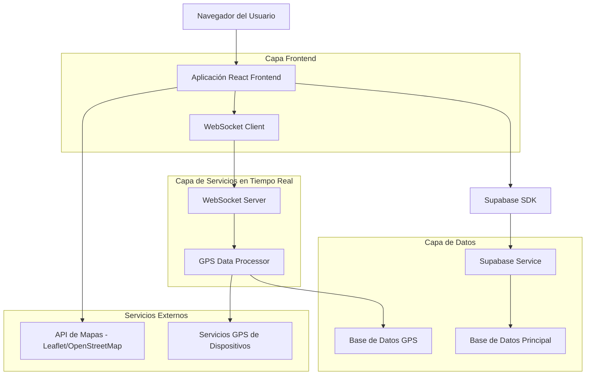
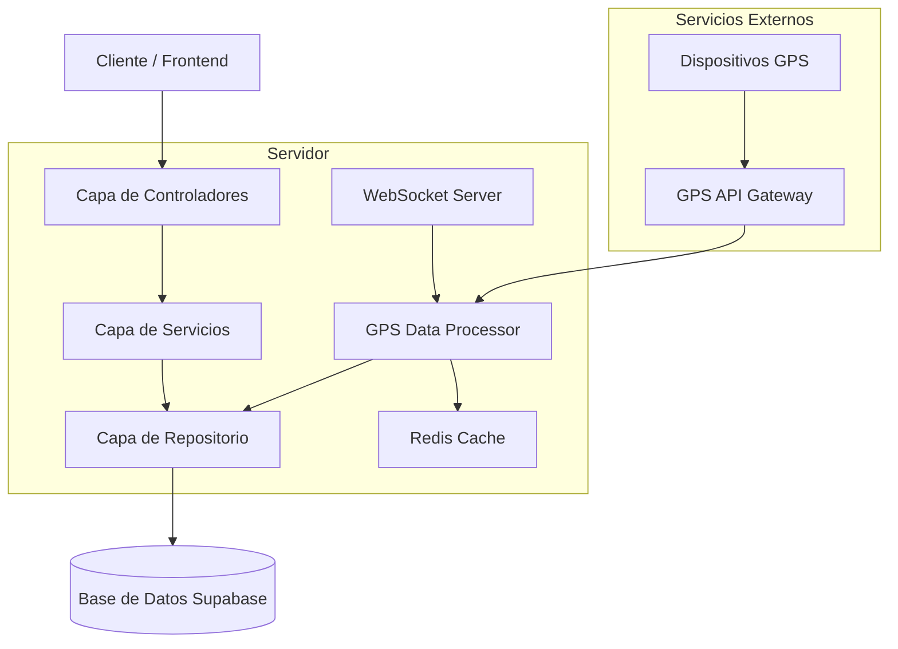
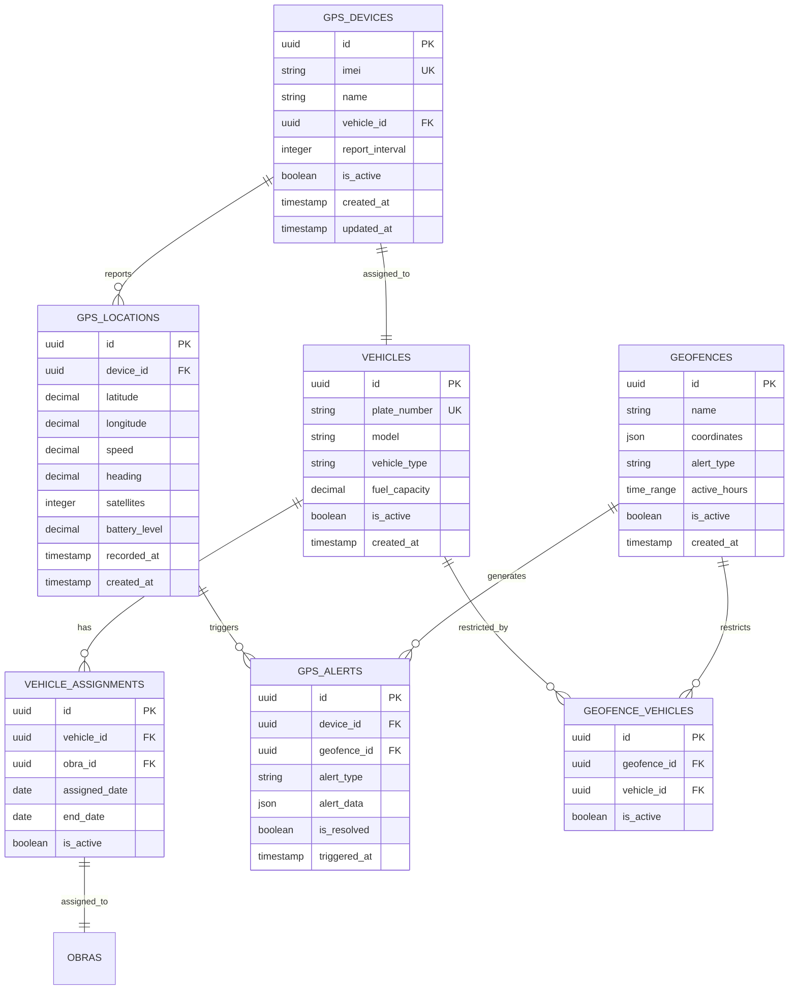

# Sistema de Seguimiento GPS - Documento de Arquitectura Técnica

## 1. Diseño de Arquitectura



## 2. Descripción de Tecnologías

- **Frontend**: React@18 + TypeScript + Tailwind CSS + Vite
- **Mapas**: Leaflet@1.9 + React-Leaflet@4.2 + OpenStreetMap
- **Tiempo Real**: Socket.io-client@4.7 para WebSockets
- **Backend**: Node.js + Express@4.18 + Socket.io@4.7
- **Base de Datos**: Supabase (PostgreSQL) + Redis para cache de ubicaciones
- **Autenticación**: Supabase Auth

## 3. Definiciones de Rutas

| Ruta | Propósito |
|------|-----------|
| /logistics/gps | Panel principal de seguimiento GPS con mapa en tiempo real |
| /logistics/gps/devices | Gestión de dispositivos GPS registrados |
| /logistics/gps/alerts | Configuración de alertas y geofencing |
| /logistics/gps/reports | Reportes y análisis de movimientos |
| /logistics/gps/vehicles | Configuración de vehículos y asignaciones |
| /logistics/gps/history/:vehicleId | Historial detallado de un vehículo específico |

## 4. Definiciones de API

### 4.1 API Principal

**Gestión de Dispositivos GPS**
```
POST /api/gps/devices
```

Request:
| Nombre del Parámetro | Tipo de Parámetro | Es Requerido | Descripción |
|---------------------|-------------------|--------------|-------------|
| imei | string | true | Identificador único del dispositivo GPS |
| name | string | true | Nombre descriptivo del dispositivo |
| vehicle_id | string | true | ID del vehículo asignado |
| report_interval | number | false | Intervalo de reporte en segundos (default: 30) |

Response:
| Nombre del Parámetro | Tipo de Parámetro | Descripción |
|---------------------|-------------------|-------------|
| success | boolean | Estado de la operación |
| device_id | string | ID del dispositivo creado |
| message | string | Mensaje de confirmación |

**Obtener Ubicaciones en Tiempo Real**
```
GET /api/gps/locations/live
```

Request:
| Nombre del Parámetro | Tipo de Parámetro | Es Requerido | Descripción |
|---------------------|-------------------|--------------|-------------|
| obra_id | string | false | Filtrar por obra específica |
| vehicle_type | string | false | Filtrar por tipo de vehículo |

Response:
| Nombre del Parámetro | Tipo de Parámetro | Descripción |
|---------------------|-------------------|-------------|
| locations | array | Array de ubicaciones actuales |
| timestamp | string | Timestamp de la consulta |

**Configurar Geofencing**
```
POST /api/gps/geofences
```

Request:
| Nombre del Parámetro | Tipo de Parámetro | Es Requerido | Descripción |
|---------------------|-------------------|--------------|-------------|
| name | string | true | Nombre de la zona geográfica |
| coordinates | array | true | Array de coordenadas [lat, lng] |
| alert_type | string | true | Tipo de alerta: 'entry', 'exit', 'both' |
| vehicles | array | false | IDs de vehículos afectados |

Ejemplo:
```json
{
  "imei": "123456789012345",
  "name": "GPS Camión 001",
  "vehicle_id": "uuid-vehicle-001",
  "report_interval": 30
}
```

### 4.2 WebSocket Events

**Eventos de Ubicación en Tiempo Real**
```
// Cliente escucha
socket.on('location_update', (data) => {
  // data: { vehicle_id, lat, lng, speed, heading, timestamp }
});

// Cliente envía
socket.emit('subscribe_vehicle', { vehicle_id: 'uuid' });
```

**Eventos de Alertas**
```
// Alertas de geofencing
socket.on('geofence_alert', (data) => {
  // data: { vehicle_id, geofence_name, alert_type, timestamp }
});

// Alertas de velocidad
socket.on('speed_alert', (data) => {
  // data: { vehicle_id, current_speed, speed_limit, location }
});
```

## 5. Diagrama de Arquitectura del Servidor



## 6. Modelo de Datos

### 6.1 Definición del Modelo de Datos



### 6.2 Lenguaje de Definición de Datos

**Tabla de Dispositivos GPS (gps_devices)**
```sql
-- Crear tabla
CREATE TABLE gps_devices (
    id UUID PRIMARY KEY DEFAULT gen_random_uuid(),
    imei VARCHAR(15) UNIQUE NOT NULL,
    name VARCHAR(100) NOT NULL,
    vehicle_id UUID REFERENCES vehicles(id),
    report_interval INTEGER DEFAULT 30,
    is_active BOOLEAN DEFAULT true,
    created_at TIMESTAMP WITH TIME ZONE DEFAULT NOW(),
    updated_at TIMESTAMP WITH TIME ZONE DEFAULT NOW()
);

-- Crear índices
CREATE INDEX idx_gps_devices_vehicle_id ON gps_devices(vehicle_id);
CREATE INDEX idx_gps_devices_imei ON gps_devices(imei);
CREATE INDEX idx_gps_devices_active ON gps_devices(is_active);

-- Permisos Supabase
GRANT SELECT ON gps_devices TO anon;
GRANT ALL PRIVILEGES ON gps_devices TO authenticated;
```

**Tabla de Ubicaciones GPS (gps_locations)**
```sql
-- Crear tabla
CREATE TABLE gps_locations (
    id UUID PRIMARY KEY DEFAULT gen_random_uuid(),
    device_id UUID REFERENCES gps_devices(id) ON DELETE CASCADE,
    latitude DECIMAL(10, 8) NOT NULL,
    longitude DECIMAL(11, 8) NOT NULL,
    speed DECIMAL(5, 2) DEFAULT 0,
    heading DECIMAL(5, 2) DEFAULT 0,
    satellites INTEGER DEFAULT 0,
    battery_level DECIMAL(5, 2) DEFAULT 100,
    recorded_at TIMESTAMP WITH TIME ZONE NOT NULL,
    created_at TIMESTAMP WITH TIME ZONE DEFAULT NOW()
);

-- Crear índices
CREATE INDEX idx_gps_locations_device_id ON gps_locations(device_id);
CREATE INDEX idx_gps_locations_recorded_at ON gps_locations(recorded_at DESC);
CREATE INDEX idx_gps_locations_coordinates ON gps_locations(latitude, longitude);

-- Permisos Supabase
GRANT SELECT ON gps_locations TO anon;
GRANT ALL PRIVILEGES ON gps_locations TO authenticated;
```

**Tabla de Geofencing (geofences)**
```sql
-- Crear tabla
CREATE TABLE geofences (
    id UUID PRIMARY KEY DEFAULT gen_random_uuid(),
    name VARCHAR(100) NOT NULL,
    coordinates JSON NOT NULL,
    alert_type VARCHAR(20) CHECK (alert_type IN ('entry', 'exit', 'both')),
    active_hours JSONB DEFAULT '{"start": "00:00", "end": "23:59"}',
    is_active BOOLEAN DEFAULT true,
    created_at TIMESTAMP WITH TIME ZONE DEFAULT NOW()
);

-- Crear índices
CREATE INDEX idx_geofences_active ON geofences(is_active);
CREATE INDEX idx_geofences_name ON geofences(name);

-- Permisos Supabase
GRANT SELECT ON geofences TO anon;
GRANT ALL PRIVILEGES ON geofences TO authenticated;
```

**Tabla de Alertas GPS (gps_alerts)**
```sql
-- Crear tabla
CREATE TABLE gps_alerts (
    id UUID PRIMARY KEY DEFAULT gen_random_uuid(),
    device_id UUID REFERENCES gps_devices(id),
    geofence_id UUID REFERENCES geofences(id),
    alert_type VARCHAR(50) NOT NULL,
    alert_data JSON,
    is_resolved BOOLEAN DEFAULT false,
    triggered_at TIMESTAMP WITH TIME ZONE DEFAULT NOW()
);

-- Crear índices
CREATE INDEX idx_gps_alerts_device_id ON gps_alerts(device_id);
CREATE INDEX idx_gps_alerts_triggered_at ON gps_alerts(triggered_at DESC);
CREATE INDEX idx_gps_alerts_resolved ON gps_alerts(is_resolved);

-- Permisos Supabase
GRANT SELECT ON gps_alerts TO anon;
GRANT ALL PRIVILEGES ON gps_alerts TO authenticated;

-- Datos iniciales de ejemplo
INSERT INTO gps_devices (imei, name, vehicle_id, report_interval)
VALUES 
    ('123456789012345', 'GPS Camión Principal', (SELECT id FROM vehicles LIMIT 1), 30),
    ('123456789012346', 'GPS Camioneta Supervisión', (SELECT id FROM vehicles LIMIT 1 OFFSET 1), 60);
```