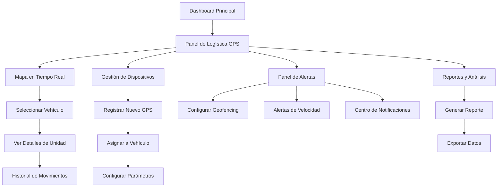

# Sistema de Seguimiento GPS - Documento de Requerimientos del Producto

## 1. Resumen del Producto

El Sistema de Seguimiento GPS es una extensión del panel de logística que permite monitorear en tiempo real la ubicación de vehículos y unidades de trabajo mediante dispositivos GPS. El sistema proporciona visualización en mapa interactivo, gestión de dispositivos, alertas geográficas y análisis de rutas para optimizar las operaciones logísticas.

- **Propósito principal**: Permitir el seguimiento en tiempo real de vehículos y equipos para mejorar la eficiencia operativa y la seguridad.
- **Usuarios objetivo**: Supervisores de logística, coordinadores de obra, gerentes de operaciones y personal administrativo.
- **Valor del mercado**: Reducción de costos operativos del 15-25% mediante optimización de rutas y mejor control de activos móviles.

## 2. Características Principales

### 2.1 Roles de Usuario

| Rol | Método de Registro | Permisos Principales |
|-----|-------------------|---------------------|
| Supervisor de Logística | Asignación por administrador | Visualizar todas las unidades, configurar alertas, generar reportes |
| Coordinador de Obra | Asignación por supervisor | Visualizar unidades asignadas a su obra, recibir notificaciones |
| Operador de Vehículo | Registro con código de unidad | Actualizar estado, reportar incidencias |
| Administrador del Sistema | Acceso completo | Gestionar dispositivos GPS, configurar geofencing, administrar usuarios |

### 2.2 Módulos de Funcionalidad

Nuestro sistema de seguimiento GPS consta de las siguientes páginas principales:

1. **Panel de Mapa en Tiempo Real**: visualización interactiva, controles de zoom, filtros por tipo de unidad, estado de conexión GPS.
2. **Gestión de Dispositivos GPS**: registro de nuevos dispositivos, configuración de parámetros, asignación a vehículos, estado de batería y conectividad.
3. **Panel de Alertas y Notificaciones**: configuración de geofencing, alertas de velocidad, notificaciones de mantenimiento, historial de eventos.
4. **Reportes y Análisis**: historial de rutas, análisis de combustible, reportes de tiempo de trabajo, estadísticas de uso.
5. **Configuración de Unidades**: registro de vehículos, asignación de conductores, configuración de parámetros operativos.

### 2.3 Detalles de Páginas

| Nombre de Página | Nombre del Módulo | Descripción de Funcionalidad |
|------------------|-------------------|------------------------------|
| Panel de Mapa | Mapa Interactivo | Mostrar ubicaciones en tiempo real con iconos diferenciados por tipo de vehículo, zoom automático, capas de información |
| Panel de Mapa | Control de Filtros | Filtrar por obra, tipo de vehículo, estado operativo, rango de fechas para historial |
| Panel de Mapa | Panel de Información | Mostrar detalles de vehículo seleccionado: velocidad, dirección, último reporte, estado del motor |
| Gestión GPS | Registro de Dispositivos | Agregar nuevos dispositivos GPS con IMEI, configurar intervalos de reporte, asignar a vehículos |
| Gestión GPS | Estado de Conectividad | Monitorear conexión GPS, nivel de batería, calidad de señal, último ping recibido |
| Gestión GPS | Configuración Avanzada | Establecer parámetros de reporte, configurar modos de ahorro de energía, calibración |
| Alertas | Configuración de Geofencing | Crear zonas geográficas, definir alertas de entrada/salida, configurar horarios permitidos |
| Alertas | Alertas de Velocidad | Establecer límites de velocidad por zona, configurar notificaciones automáticas |
| Alertas | Centro de Notificaciones | Visualizar alertas activas, historial de eventos, configurar destinatarios de notificaciones |
| Reportes | Historial de Rutas | Visualizar trayectorias históricas, análisis de tiempo en sitio, cálculo de distancias recorridas |
| Reportes | Análisis Operativo | Reportes de eficiencia de combustible, tiempo de inactividad, cumplimiento de horarios |
| Reportes | Exportación de Datos | Generar reportes en PDF/Excel, programar reportes automáticos, dashboard ejecutivo |
| Configuración | Registro de Vehículos | Agregar información de vehículos: placa, modelo, capacidad, asignar conductor |
| Configuración | Asignación de Obras | Vincular vehículos con obras específicas, configurar rutas predefinidas |
| Configuración | Mantenimiento | Programar alertas de mantenimiento basadas en kilometraje o tiempo, historial de servicios |

## 3. Proceso Principal

### Flujo del Supervisor de Logística:
1. Accede al panel de mapa desde el dashboard principal
2. Visualiza todas las unidades activas en tiempo real
3. Configura alertas y geofencing según necesidades operativas
4. Monitorea el cumplimiento de rutas y horarios
5. Genera reportes de eficiencia y rendimiento
6. Toma decisiones basadas en datos de ubicación y movimiento

### Flujo del Coordinador de Obra:
1. Accede al panel filtrado por su obra específica
2. Verifica la llegada y salida de vehículos asignados
3. Recibe notificaciones de retrasos o desvíos
4. Coordina con conductores mediante el sistema
5. Reporta incidencias o cambios de ruta

## 4. Diseño de Interfaz de Usuario

### 4.1 Estilo de Diseño

- **Colores primarios**: Azul corporativo (#2563eb), Verde para estados activos (#10b981)
- **Colores secundarios**: Gris para elementos neutros (#6b7280), Rojo para alertas (#ef4444)
- **Estilo de botones**: Redondeados con sombras sutiles, efectos hover suaves
- **Tipografía**: Inter para textos principales (14px-16px), Roboto Mono para datos técnicos (12px)
- **Estilo de layout**: Diseño de tarjetas con bordes redondeados, navegación lateral expandible
- **Iconos**: Material Design Icons para consistencia, iconos de vehículos personalizados para el mapa

### 4.2 Resumen de Diseño de Páginas

| Nombre de Página | Nombre del Módulo | Elementos de UI |
|------------------|-------------------|-----------------|
| Panel de Mapa | Mapa Interactivo | Mapa de pantalla completa con Leaflet, controles de zoom flotantes, panel lateral deslizable con lista de vehículos |
| Panel de Mapa | Filtros y Controles | Barra superior con filtros dropdown, botones de toggle para capas, selector de rango temporal |
| Panel de Mapa | Panel de Información | Tarjeta flotante con datos del vehículo seleccionado, gráficos de velocidad en tiempo real, botones de acción |
| Gestión GPS | Lista de Dispositivos | Tabla responsiva con estado de conectividad, indicadores de batería, botones de acción por fila |
| Gestión GPS | Formulario de Registro | Modal con campos de configuración, validación en tiempo real, preview de configuración |
| Alertas | Configuración de Zonas | Herramientas de dibujo en mapa, lista de zonas creadas, configuración de horarios con time picker |
| Alertas | Centro de Notificaciones | Timeline de eventos, filtros por tipo de alerta, sistema de badges para nuevas notificaciones |
| Reportes | Dashboard de Métricas | Cards con KPIs principales, gráficos interactivos con Chart.js, filtros de fecha prominentes |
| Reportes | Visualización de Rutas | Mapa con overlay de rutas históricas, controles de reproducción temporal, panel de estadísticas |

### 4.3 Responsividad

- **Diseño mobile-first** con breakpoints en 768px y 1024px
- **Optimización táctil** para controles de mapa en dispositivos móviles
- **Navegación adaptativa** que se colapsa en pantallas pequeñas
- **Tablas responsivas** con scroll horizontal y vista de tarjetas en móvil
- **Mapas adaptativos** con controles redimensionados para touch