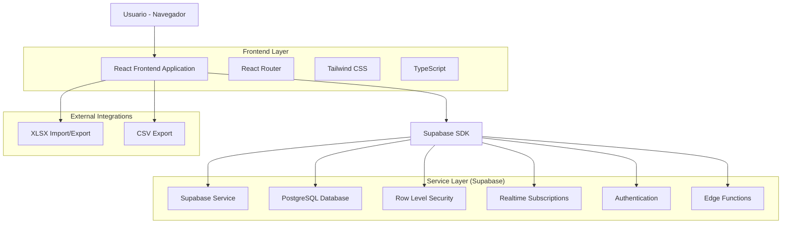
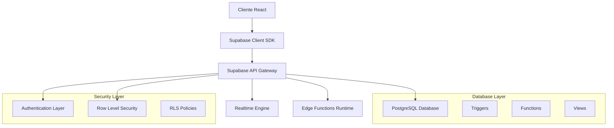
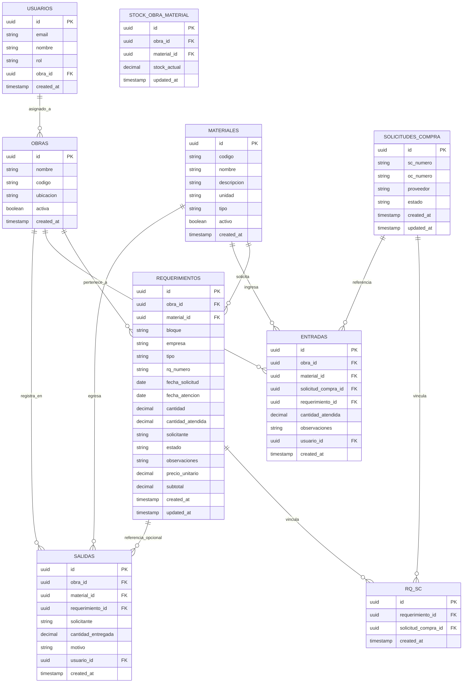

# Arquitectura Técnica - Sistema de Almacén de Obra

## 1. Diseño de Arquitectura



## 2. Descripción de Tecnologías

- **Frontend**: React@18 + TypeScript@5 + Tailwind CSS@3 + Vite@5
- **Backend**: Supabase (PostgreSQL + Auth + RLS + Realtime + Edge Functions)
- **Librerías adicionales**: 
  - react-router-dom@6 (navegación)
  - @supabase/supabase-js@2 (cliente Supabase)
  - xlsx@0.18 (importación/exportación Excel)
  - date-fns@2 (manejo de fechas)
  - react-hook-form@7 (formularios)
  - @headlessui/react@1 (componentes UI)

## 3. Definiciones de Rutas

| Ruta | Propósito |
|------|----------|
| / | Página de inicio con dashboard general y navegación principal |
| /login | Página de autenticación con Supabase Auth |
| /oficina/requerimientos | Gestión de RQ con tabla de 19 columnas y carga XLSX |
| /logistica/asignaciones | Asignación de SC/OC/Proveedor con buscador y auditoría |
| /almacen/entradas | Registro de entradas por SC con validación de cantidades |
| /almacen/salidas | Registro de salidas con validación de stock |
| /stock/kardex | Consulta de stock actual y kardex histórico |
| /reportes | Exportación de reportes en CSV/XLSX |
| /perfil | Configuración de usuario y cambio de obra asignada |

## 4. Definiciones de API

### 4.1 APIs Core de Supabase

**Autenticación de usuarios**
```typescript
// Login
supabase.auth.signInWithPassword({
  email: string,
  password: string
})

// Obtener usuario actual
supabase.auth.getUser()
```

**Gestión de Requerimientos**
```typescript
// Crear requerimiento
POST /rest/v1/requerimientos
```

Request:
| Parámetro | Tipo | Requerido | Descripción |
|-----------|------|-----------|-------------|
| bloque | string | true | Bloque de la obra |
| empresa | string | true | Empresa solicitante |
| tipo | string | true | Tipo de material |
| material | string | true | Nombre del material |
| codigo | string | true | Código del material |
| descripcion | string | true | Descripción detallada |
| rq_numero | string | true | Número de requerimiento |
| fecha_solicitud | date | true | Fecha de solicitud |
| unidad | string | true | Unidad de medida |
| cantidad | number | true | Cantidad solicitada |
| solicitante | string | true | Nombre del solicitante |

Response:
| Parámetro | Tipo | Descripción |
|-----------|------|-------------|
| id | uuid | ID único del requerimiento |
| created_at | timestamp | Fecha de creación |
| updated_at | timestamp | Fecha de última actualización |

**Gestión de Entradas**
```typescript
// Registrar entrada
POST /rest/v1/entradas
```

Request:
| Parámetro | Tipo | Requerido | Descripción |
|-----------|------|-----------|-------------|
| obra_id | uuid | true | ID de la obra |
| material_id | uuid | true | ID del material |
| sc_numero | string | true | Número de solicitud de compra |
| cantidad_atendida | number | true | Cantidad recibida |
| observaciones | string | false | Observaciones del ingreso |

**Gestión de Salidas**
```typescript
// Registrar salida
POST /rest/v1/salidas
```

Request:
| Parámetro | Tipo | Requerido | Descripción |
|-----------|------|-----------|-------------|
| obra_id | uuid | true | ID de la obra |
| material_id | uuid | true | ID del material |
| solicitante | string | true | Nombre del solicitante |
| cantidad_entregada | number | true | Cantidad a entregar |
| motivo | string | true | Motivo de la salida |
| rq_numero | string | false | Número de RQ relacionado |

### 4.2 Edge Functions

**Importación XLSX**
```typescript
// Subir y procesar archivo XLSX
POST /functions/v1/import-xlsx
```

Request:
| Parámetro | Tipo | Requerido | Descripción |
|-----------|------|-----------|-------------|
| file | File | true | Archivo XLSX a procesar |
| obra_id | uuid | true | ID de la obra |

Response:
```json
{
  "success": true,
  "processed_rows": 150,
  "errors": [
    {
      "row": 5,
      "field": "cantidad",
      "message": "Debe ser un número positivo"
    }
  ]
}
```

## 5. Arquitectura del Servidor



## 6. Modelo de Datos

### 6.1 Definición del Modelo de Datos



### 6.2 Lenguaje de Definición de Datos (DDL)

**Tabla de Usuarios**
```sql
-- Crear tabla usuarios
CREATE TABLE usuarios (
    id UUID PRIMARY KEY DEFAULT gen_random_uuid(),
    email VARCHAR(255) UNIQUE NOT NULL,
    nombre VARCHAR(100) NOT NULL,
    rol VARCHAR(20) NOT NULL CHECK (rol IN ('COORDINACION', 'LOGISTICA', 'ALMACENERO')),
    obra_id UUID REFERENCES obras(id),
    created_at TIMESTAMP WITH TIME ZONE DEFAULT NOW(),
    updated_at TIMESTAMP WITH TIME ZONE DEFAULT NOW()
);

-- Habilitar RLS
ALTER TABLE usuarios ENABLE ROW LEVEL SECURITY;

-- Crear índices
CREATE INDEX idx_usuarios_email ON usuarios(email);
CREATE INDEX idx_usuarios_rol ON usuarios(rol);
CREATE INDEX idx_usuarios_obra_id ON usuarios(obra_id);
```

**Tabla de Obras**
```sql
-- Crear tabla obras
CREATE TABLE obras (
    id UUID PRIMARY KEY DEFAULT gen_random_uuid(),
    nombre VARCHAR(100) NOT NULL,
    codigo VARCHAR(20) UNIQUE NOT NULL,
    ubicacion VARCHAR(200),
    activa BOOLEAN DEFAULT true,
    created_at TIMESTAMP WITH TIME ZONE DEFAULT NOW()
);

-- Habilitar RLS
ALTER TABLE obras ENABLE ROW LEVEL SECURITY;

-- Crear índices
CREATE INDEX idx_obras_codigo ON obras(codigo);
CREATE INDEX idx_obras_activa ON obras(activa);
```

**Tabla de Materiales**
```sql
-- Crear tabla materiales
CREATE TABLE materiales (
    id UUID PRIMARY KEY DEFAULT gen_random_uuid(),
    codigo VARCHAR(50) UNIQUE NOT NULL,
    nombre VARCHAR(200) NOT NULL,
    descripcion TEXT,
    unidad VARCHAR(20) NOT NULL,
    tipo VARCHAR(50),
    activo BOOLEAN DEFAULT true,
    created_at TIMESTAMP WITH TIME ZONE DEFAULT NOW()
);

-- Habilitar RLS
ALTER TABLE materiales ENABLE ROW LEVEL SECURITY;

-- Crear índices
CREATE INDEX idx_materiales_codigo ON materiales(codigo);
CREATE INDEX idx_materiales_nombre ON materiales(nombre);
CREATE INDEX idx_materiales_tipo ON materiales(tipo);
CREATE INDEX idx_materiales_activo ON materiales(activo);
```

**Tabla de Requerimientos**
```sql
-- Crear tabla requerimientos
CREATE TABLE requerimientos (
    id UUID PRIMARY KEY DEFAULT gen_random_uuid(),
    obra_id UUID NOT NULL REFERENCES obras(id),
    material_id UUID NOT NULL REFERENCES materiales(id),
    bloque VARCHAR(50),
    empresa VARCHAR(100),
    tipo VARCHAR(50),
    rq_numero VARCHAR(50) NOT NULL,
    fecha_solicitud DATE NOT NULL,
    fecha_atencion DATE,
    cantidad DECIMAL(10,2) NOT NULL CHECK (cantidad > 0),
    cantidad_atendida DECIMAL(10,2) DEFAULT 0 CHECK (cantidad_atendida >= 0 AND cantidad_atendida <= cantidad),
    solicitante VARCHAR(100) NOT NULL,
    estado VARCHAR(20) DEFAULT 'PENDIENTE' CHECK (estado IN ('PENDIENTE', 'PARCIAL', 'ATENDIDO', 'CANCELADO')),
    observaciones TEXT,
    precio_unitario DECIMAL(10,2),
    subtotal DECIMAL(10,2),
    created_at TIMESTAMP WITH TIME ZONE DEFAULT NOW(),
    updated_at TIMESTAMP WITH TIME ZONE DEFAULT NOW(),
    UNIQUE(obra_id, rq_numero)
);

-- Habilitar RLS
ALTER TABLE requerimientos ENABLE ROW LEVEL SECURITY;

-- Crear índices
CREATE INDEX idx_requerimientos_obra_id ON requerimientos(obra_id);
CREATE INDEX idx_requerimientos_material_id ON requerimientos(material_id);
CREATE INDEX idx_requerimientos_rq_numero ON requerimientos(rq_numero);
CREATE INDEX idx_requerimientos_estado ON requerimientos(estado);
CREATE INDEX idx_requerimientos_fecha_solicitud ON requerimientos(fecha_solicitud);
CREATE INDEX idx_requerimientos_solicitante ON requerimientos(solicitante);
```

**Vista v_me para RLS**
```sql
-- Crear vista para obtener información del usuario actual
CREATE OR REPLACE VIEW v_me AS
SELECT 
    u.id,
    u.email,
    u.nombre,
    u.rol,
    u.obra_id
FROM usuarios u
WHERE u.id = auth.uid();

-- Otorgar permisos
GRANT SELECT ON v_me TO authenticated;
```

**Función para actualizar stock**
```sql
-- Función para recalcular stock
CREATE OR REPLACE FUNCTION actualizar_stock_obra_material()
RETURNS TRIGGER AS $$
BEGIN
    -- Recalcular stock para la combinación obra-material afectada
    INSERT INTO stock_obra_material (obra_id, material_id, stock_actual, updated_at)
    SELECT 
        COALESCE(NEW.obra_id, OLD.obra_id) as obra_id,
        COALESCE(NEW.material_id, OLD.material_id) as material_id,
        COALESCE(SUM(e.cantidad_atendida), 0) - COALESCE(SUM(s.cantidad_entregada), 0) as stock_actual,
        NOW() as updated_at
    FROM obras o
    CROSS JOIN materiales m
    LEFT JOIN entradas e ON e.obra_id = o.id AND e.material_id = m.id
    LEFT JOIN salidas s ON s.obra_id = o.id AND s.material_id = m.id
    WHERE o.id = COALESCE(NEW.obra_id, OLD.obra_id)
    AND m.id = COALESCE(NEW.material_id, OLD.material_id)
    GROUP BY o.id, m.id
    ON CONFLICT (obra_id, material_id) 
    DO UPDATE SET 
        stock_actual = EXCLUDED.stock_actual,
        updated_at = EXCLUDED.updated_at;
    
    RETURN COALESCE(NEW, OLD);
END;
$$ LANGUAGE plpgsql;

-- Crear triggers para actualización automática de stock
CREATE TRIGGER trigger_actualizar_stock_entradas
    AFTER INSERT OR UPDATE OR DELETE ON entradas
    FOR EACH ROW EXECUTE FUNCTION actualizar_stock_obra_material();

CREATE TRIGGER trigger_actualizar_stock_salidas
    AFTER INSERT OR UPDATE OR DELETE ON salidas
    FOR EACH ROW EXECUTE FUNCTION actualizar_stock_obra_material();
```

**Políticas RLS**
```sql
-- Políticas para COORDINACION (acceso total)
CREATE POLICY "coordinacion_all_access" ON requerimientos
    FOR ALL TO authenticated
    USING ((SELECT rol FROM v_me) = 'COORDINACION');

-- Políticas para LOGISTICA (lectura global, edición limitada)
CREATE POLICY "logistica_select_all" ON requerimientos
    FOR SELECT TO authenticated
    USING ((SELECT rol FROM v_me) = 'LOGISTICA');

CREATE POLICY "logistica_update_limited" ON requerimientos
    FOR UPDATE TO authenticated
    USING ((SELECT rol FROM v_me) = 'LOGISTICA');

-- Políticas para ALMACENERO (solo su obra)
CREATE POLICY "almacenero_select_obra" ON requerimientos
    FOR SELECT TO authenticated
    USING ((SELECT rol FROM v_me) = 'ALMACENERO' AND obra_id = (SELECT obra_id FROM v_me));

CREATE POLICY "almacenero_entradas_obra" ON entradas
    FOR INSERT TO authenticated
    WITH CHECK ((SELECT rol FROM v_me) = 'ALMACENERO' AND obra_id = (SELECT obra_id FROM v_me));

CREATE POLICY "almacenero_salidas_obra" ON salidas
    FOR INSERT TO authenticated
    WITH CHECK ((SELECT rol FROM v_me) = 'ALMACENERO' AND obra_id = (SELECT obra_id FROM v_me));
```

**Datos iniciales**
```sql
-- Insertar obras de ejemplo
INSERT INTO obras (nombre, codigo, ubicacion) VALUES
('Edificio Central', 'EC001', 'Av. Principal 123'),
('Torre Norte', 'TN002', 'Calle Secundaria 456'),
('Complejo Sur', 'CS003', 'Zona Industrial 789');

-- Insertar materiales de ejemplo
INSERT INTO materiales (codigo, nombre, descripcion, unidad, tipo) VALUES
('CEM001', 'Cemento Portland', 'Cemento tipo I para construcción', 'BOLSA', 'CEMENTO'),
('ACE001', 'Acero corrugado 12mm', 'Varilla de acero corrugado de 12mm', 'VARILLA', 'ACERO'),
('LAD001', 'Ladrillo común', 'Ladrillo de arcilla cocida', 'UNIDAD', 'LADRILLO');
```